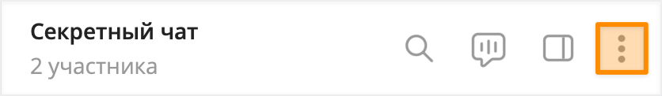
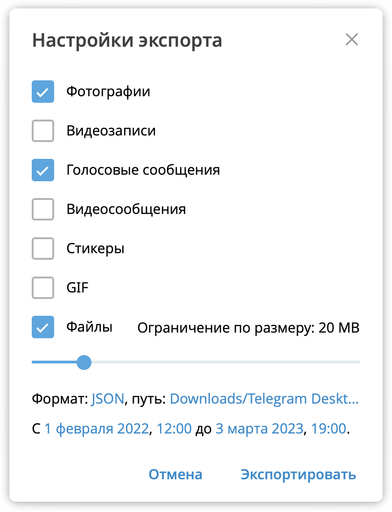
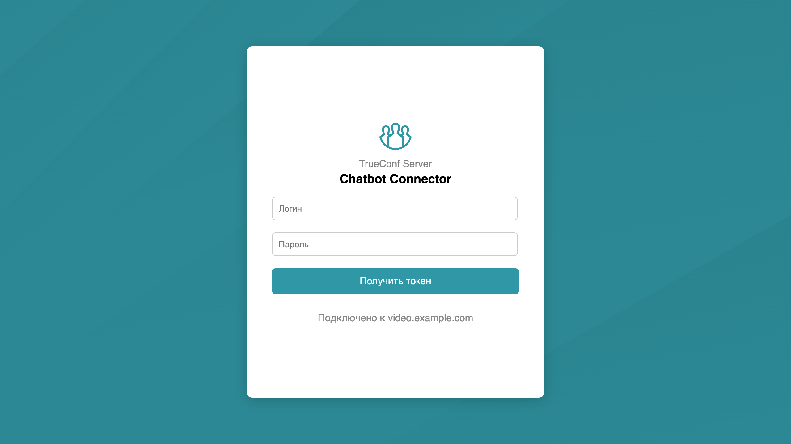
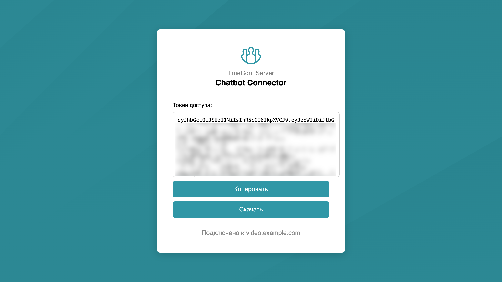

<p align="center">
  <a href="https://trueconf.ru" target="_blank" rel="noopener noreferrer">
    <picture>
      <source media="(prefers-color-scheme: dark)" srcset="assets/logo-cyrillic.svg" type="image/svg">
      
    </picture>
  </a>
</p>

<h1 align="center">🛡️ Безопасный перенос чатов из Telegram в TrueConf</h1>

<p align="center">Нужен безопасный мессенджер без блокировок?
Тогда переноси все свои чаты из Telegram в TrueConf всего за пару кликов. 
Поддержан перенос только в on-premise версии <a href="https://trueconf.ru/products/server/server-videokonferenciy.html">TrueConf Server</a> / <a href="https://trueconf.ru/products/enterprise/trueconf-enterprise.html">TrueConf Enterprise</a>.</p>

<p align="center">
     <a href="https://pypi.org/project/python-trueconf-bot" target="_blank">
      
</a>
    <a href="https://t.me/trueconf_chat" target="_blank">
        
    </a>
</p>

<p align="center">
  
</p>


<p align="center">
  <a href="README-ru.md">English</a> /
  <a href="./README-ru.md">Русский</a>
</p>

## Введение

Для переноса переписки из Telegram в TrueConf вы должны:

1. [Экспортировать чат Telegram](#экспорт-чата-telegram).
2. [Настроить конфигурационный файл](#настройка-конфигурационного-файла).
3. При [необходимости создать](#автоматическое-добавление-пользователей-в-trueconf-server) заранее учётные записи пользователей на сервере видеосвязи.
4. [Запустить скрипт](#перенос-чата).

Также вам понадобится:

- установленное приложение [Telegram Desktop](https://desktop.telegram.org/);
- развернутый [TrueConf Server](https://trueconf.ru/products/tcsf/besplatniy-server-videoconferenciy.html) версии 5.5 или выше ([инструкция](https://trueconf.ru/docs/server/ru/admin/server-part/));
- установленный Python 3.11 или выше;
- щепотка терпения.

## Скачивание репозитория и настройка окружения

Для скачивания файлов/скриптов на главной странице репозитория нажмите кнопку **Code** и выберите **Download ZIP**. После чего распакуйте архив в какую-то директорию.

### Python

Для работы с подготовленными скриптами у вас должен быть установлен Python 3.11 или выше. Для Windows вы можете скачать его с [официального сайта](https://www.python.org/). В Linux и macOS как правило Python уже предустановлен. Проверьте вашу версию с помощью команды:

```bash
> python --version
Python 3.12.4
```

> [!IMPORTANT]
> В случае необходимости обновите вашу версию, иначе скрипт не сработает.

### Настройка окружения

Для установки зависимостей и настройки окружения мы используем **pipenv**. По умолчанию он отсутствует в системе и его нужно установить:

```bash
pip install pipenv
```

Далее в терминале перейдите в директорию в которую вы распаковали архив:

```bash
cd path/to/folder 
```

и выполните команду для настройки окружения:

```bash
pipenv install
```

## Экспорт чата Telegram

После установки и авторизации в приложении Telegram Desktop вам станут доступны все ваши чаты.

> [!TIP]
> Если вы являетесь администратором организации и не имеете доступ к целевым перепискам, то вы можете попросить любого участника чата экспортировать историю вместо вас.

Для экспорта истории:

1. Перейдите в чат и его заголовке нажмите кнопку с тремя точками:

<p align="center"></p>

1. В меню выберите пункт **Экспорт истории чата**.

2. В окне настроек экспорта:

   - отметьте галочками нужные вам медиа;
   - для файлов выставьте ограничение по размеру;
   - в формате укажите **JSON**;
   - укажите путь для сохранения или оставьте по умолчанию `Загрузки/Telegram Desktop/`;
   - настройте диапазон, например с первого сообщения до текущей даты, с 01.02.2022 12:00 по 03.03.2023 19:00 и т.д.

<p align="center"></p>

3. Нажмите кнопку **Экспортировать**.

После чего начнется сохранение чата с выбранными настройками. Данное окно можно закрыть, если оно вам мешает.

> [!CAUTION]
> Дождитесь полного завершения операции. Если вы выбрали диапазон дат и видите, что сообщения выгружены, не отменяйте процесс, чтобы избежать повреждения файла.

## Настройка конфигурационного файла

### Описание 

> [!NOTE]
> Мы используем настройку конфигурации с помощью языка [TOML](https://toml.io/).

Откройте файл `config.toml`. В нем вы увидите следующую структуру: 

```toml
telegram_export_dir = ""

[server]
address = "" # IP or domain.name
verify_ssl = false # or true if needed
access_token = "" # If you don't use access_token enter `client_id` and `client_secret`
client_id = ""
client_secret = ""


[chat]
name = ""
type = "" # available: personal, group, channel
owner = "" # who created chat

[chat.datetime]
view_original_time_in_message = false # or true if needed
timezone = "GMT" # need if view_original_time_in_message = true
caption = "" # example: f"{caption}{dt}"


[chat.voice_message]
convert_voice_message_to_video = false
cover_image = "cover/en.png" # by default "cover/en.png"

[registration]
auto = false # or true if needed
email_domain = "" # If it does not exist, the external server name will be substituted.
default_password = ""

[users]

[users.trueconf_id]
display_name = ""
password = ""

access_token = ""
telegram_id = ""
type = ""
```

Для успешного переноса вам необходимо заполнить конфигурационный файл по следующему описанию: 

| Секция             | Параметр                       | Описание                                                                                                                                                                                                                                                                                                 |
|--------------------|--------------------------------|----------------------------------------------------------------------------------------------------------------------------------------------------------------------------------------------------------------------------------------------------------------------------------------------------------|
|                    | telegram_export_dir            | Путь к папке с экспортированным Telegram-чатом                                                                                                                                                                                                                                                           |
| server             |                                | Настройки TrueConf Server                                                                                                                                                                                                                                                                                |
|                    | address                        | Доменное имя или IP-адрес TrueConf Server                                                                                                                                                                                                                                                                |
|                    | verify_ssl                     | Проверка SSL-сертификата. `true`, если у вас доверенный сертификат.                                                                                                                                                                                                                                      |
|                    | access_token                   | Авторизационный токен (_TTL = 1 час_). Нужен, если вы хотите автоматизировать добавление большого кол-ва пользователей в TrueConf Server через API.                                                                                                                                                      |
|                    | client_id, client_secret       | ID и секрет созданного OAuth приложения. Нужен, если вы не работали с TrueConf Server API (подробнее ниже)                                                                                                                                                                                               |                                                                                                                                     |
| chat               |                                | Настройки нового чата в TrueConf Server                                                                                                                                                                                                                                                                  |
|                    | name                           | Название чата                                                                                                                                                                                                                                                                                            |
|                    | type                           | Тип чата: `personal` (чат на двоих), `group` (групповой), `channel` (канал).                                                                                                                                                                                                                             |
|                    | owner                          | Создатель (для `personal`) и владелец чата (для `group` и `channel`)                                                                                                                                                                                                                                     |
| chat.datetime      |                                | Настройки отображения оригинальной даты и времени отправки сообщения в Telegram.                                                                                                                                                                                                                         |
|                    | view_original_time_in_message  | Если `true`, то в каждое текстовое сообщение будет добавляться дата и время отправки.                                                                                                                                                                                                                    |
|                    | timezone                       | Настройка часового пояса. Требуется указать корректный часовой пояс для большинства пользователей в чате. По умолчанию `GMT` (UTC).                                                                                                                                                                      |
|                    | caption                        | При желании вы можете добавить подпись перед датой и временем. Например, `Отправлено:` или `Дата:`.                                                                                                                                                                                                      |
| chat.voice_message |                                | Настройки переноса голосовых сообщений                                                                                                                                                                                                                                                                   |
|                    | convert_voice_message_to_video | Если `true`, то все голосовые сообщения будут сконвертированы в видео формата `mp4`. Нужен предустановленный пакет [ffmpeg](https://ffmpeg.org/).                                                                                                                                                        |
|                    | cover_image                    | Если `convert_voice_message_to_video = true`, то будет использована указанная заглушка.                                                                                                                                                                                                                  |
|                    | data_time                      | Если `true`, то в **текстовое сообщение** будет добавлено дата и время отправки оригинального сообщения из Telegram.                                                                                                                                                                                     |
| registration       |                                | Настройки автоматического добавления пользователей на TrueConf Server.                                                                                                                                                                                                                                   |
|                    | auto                           | Если `true`, то в [users] при использовании `parse_users.py` будут добавляться параметры `display_name` и `password`.                                                                                                                                                                                    |
|                    | email_domain                   | В случае использования корпоративной почты, нужно указать домен, который будет использоваться в поле `email` при автоматическом добавлении пользователя. Например, вы используете домен `mail.example.com`, то при добавлении пользователя `user` у него будет адрес эл. почты – `user@mail.example.com` |
|                    | default_password               | Общий пароль для всех учетных записей. Автозаполнение параметра `password` при использовании скрипта `parse_users.py`.                                                                                                                                                                                   |
| users              |                                | Раздел с настройкой учетных записей пользователей (участников чата). Можно заполнить автоматически с помощью `parse_users.py`.                                                                                                                                                                           |
|                    | display_name, password         | Автоматически заполняются, если `registration.auto = true`. Необходимо для автоматического добавления пользователей с помощью `add_users_to_server.py`                                                                                                                                                   |
|                    | telegram_id, type              | Цифровой Telegram ID и тип пользователя (`user`,`channel`). Автоматически заполняются при использовании `parse_users.py`.                                                                                                                                                                                |
|                    | access_token                   | Авторизационный токен пользователя в TrueConf Chatbot Connector (_TTL = 1 мес._). Необходим, для переноса чатов. Если не указан, используется `password`.                                                                                                                                                |

> [!TIP] Так много параметров нужно заполнить 🤯? 
> На самом деле – нет. Для упрощения данного процесса, мы подготовили скрипты, о чем рассказано ниже.

### Автоматический сбор пользователей

Если Telegram-чат имеет внушительное количество участников, то заполнение конфиг файла приводит в уныние :cry:. Поэтому, команда Труконф подготовила скрипт [parse_users.py](parse_users.py) для автоматического заполнения раздела `[users]`.

> [!NOTE] Что делает скрипт?
> Он анализирует файл `result.json` (из экспорта) и формирует список пользователей. 


1. В `config.toml` укажите путь к папке с экспортированным чатом:

   ```toml
   telegram_export_dir = "~/Downloads/Telegram Desktop/ChatExport_2025-09-05"
   ```

2. Запустите скрипт в настроенном окружении: 

   ```shell
   pipenv run python parse_users.py
   ```

3. В случае успеха вы получите оповещение об успешном обновлении файла конфигурации: 

   ```shell
   File 'config.toml' updated successfully
   ```

4. В `config.toml` в `[users]` у вас будут собраны все участники со следующими параметрами:

   ```toml
   [users]
   
   [users.ivanov_ivan]
   
   access_token = ""
   telegram_id = "12345678"
   type = "user"
   ```

В случае, если вы будете запускать автоматическое добавление пользователей на TrueConf Server, то в `config.toml` укажите следующие параметры:

```toml
[registration]
auto = true # Обязательно
email_domain = "mail.example.com" # Опционально (см. описание)
default_password = "12345678" # Опционально (см. описание)
```

и перезапустите скрипт.

### Автоматическое добавление пользователей в TrueConf Server

Для переноса переписок из Telegram в TrueConf необходимо, чтобы все пользователи участвующие в общении были зарегистрированы в TrueConf Server.
Если вы **не используете LDAP**, то вы можете воспользоваться скриптом [add_users_to_server.py](add_users_to_server.py) для автоматической регистрации.

> [!IMPORTANT]
> В случае настроенной инфраструктуры перейдите к следующему разделу.

Перед запуском скрипта удостоверьтесь, что все данные в блоке `[users]` удовлетворяют вашим ожиданиям. При необходимости скорректируйте TrueConf ID (до @), отображаемое имя (display_name) и пароль (password):

   ```toml
   [users.<trueconf_id>]
   
   #Пример:
   [users.ivan_ivanov]
   display_name = "Иван Иванов"
   password = "verystrongpassword1357"
   ```

> [!WARNING]
> Перепроверьте всех новых пользователей, т.к. автоматическая перерегистрация недоступна. Если вы допустите ошибку, то вам прийдется скорректировать ее через панель управления сервером.

После проверки всех данных запустите скрипт:

```shell
pipenv run python add_users_to_server.py
```

Для каждого пользователя вы получите ответ типа: 

```
Успешное добавление:
✅ User has been added to the server

Пользователь уже существует:
⚠️ User already exists on the server

Ошибка:
🔴 Error for user

```

### Правка раздела `[users]` для настроенной инфраструктуры

> [!IMPORTANT]
> Данный раздел следует изучать администраторам **только**, если у вас уже были заведены пользователи в TrueConf Server. Перед выполнением шагов выполните раздел Автоматический сбор пользователей.

Чтобы перенос чата прошел успешно, вам необходимо сопоставить пользователей Telegram с пользователями TrueConf Server. Для каждого пользователя сконфигурируйте блок `[users]` следующим образом:

1. Укажите неполный TrueConf ID (до @):

   ```toml
   [users.<trueconf_id>]
   
   # Пример:
   [users.ivan] -> [users.ivan_ivanov]
   ```

2. Укажите `access_token`:

   ```toml
   [users.ivan_ivanov]
   access_token = "eyJhbGciOiJSUzI1NiIsInR5cCI6IkpXVCJ9..."
   ```

О том, как получить авторизационный токен читайте в следующем разделе.

### Получение `access_token` для авторизации в API чатов

Для получения `access_token` необходимо отправить POST-запрос с логином и паролем учетной записи Труконф (см. [документацию](https://trueconf.ru/docs/chatbot-connector/ru/connect-and-auth/#access-token)). 
Проблема состоит в том, что администратор TrueConf Server не знает пароли учетных записей сервера. 
Просить пользователей поделиться паролем от доменной УЗ, все равно, что попросить "ключи от квартиры, где деньги лежат".

Поэтому команда Труконф подготовила [HTML-страницу](chatbot/ru/index.html), которая упростит данный процесс. Что с ней делать? Просто добавить на TrueConf Server или на нужную ноду TrueConf Enterprise.

#### Добавление страницы на веб-сервер TrueConf

1. Скопируйте папку [`chatbot`](chatbot) по пути: 

   **Windows (PowerShell):** 
   ```shell
   Copy-Item -Path "D:\chatbot" -Destination "C:\Program Files\TrueConf Server\httpconf\site" -Recurse
   ```

   **Linux:** 
   ```shell
   sudo cp ~/chatbot /opt/trueconf/server/srv/site/
   ```

2. Перезагрузите службу **TrueConf Web Manager**:
   
   **Windows (PowerShell):** 
   ```shell
   Restart-Service -Name "TrueConf Web Manager"
   ```

   **Linux:** 
   ```shell
   sudo systemctl restart trueconf-web
   ```

> [!CAUTION]
> При обновлении TrueConf Server директория `chatbot` будет удалена с сервера.

#### Инструкция по получению токена 

Попросите каждого пользователя, которого добавляете в чат, получить access_token следующим образом:

1. В браузере перейдите по адресу `https://server.address/chatbot/ru/index.html`. 
Укажите логин (TrueConf ID) и пароль в полях ввода и нажмите **Получить токен**:

   <p align="center">
     
   </p>

2. В случае успеха у вас отобразится токен. Скопируйте или скачайте его файлом для дальнейшей передачи вашему администратору:

   <p align="center">
     
   </p>

## Перенос чата

Вот вы и добрались до этого шага! Для успешного переноса в конфиге укажите название, тип и владельца чата: 

```toml
[chat]

#Пример
name = "Секретный чат"
type = "group" # available: personal, group, channel
owner = "sherlock" # who created chat
```

### Синхронизация даты и времени

По умолчанию в TrueConf Server нет возможности отправить сообщение задним числом. 
Если вам важно видеть дату и время отправки оригинального сообщения, то скорректируйте следующие настройки:

- `view_original_time_in_message` выставьте значение `true`;
- настройте часовой пояс, например, `Europe/Moscow`;
- при необходимости укажите подпись (`caption`) к дате и времени. Обязательно в конце строки оставьте **пробел**.

```toml
[chat.datetime]

veiw_original_time_in_message = true
timezone = "Europe/Moscow"
caption = "Отправлено: "
```

В таком случае внизу каждого текстового сообщения будет приписка `Отправлено: 01.09.2025 14:10:00 +0300`.

### Конвертация голосовых сообщений .ogg в .mp4

Голосовые сообщения в Telegram представлены в формате **ogg**. Клиентское приложение Труконф не поддерживает этот формат. 
Для удобства вы можете сконвертировать все аудиосообщения в видео с обложкой (`cover_image`). 
Скрипт переноса чата автоматически реализует это с помощью **ffmpeg** (должен быть предустановлен и добавлен в `path`).

Для этого: 

1. В конфиг файле укажите`convert_voice_message_to_video = true`.

2. Укажите локализацию обложки `cover/ru.png` (на русском) или `cover/en.png` (на английском). При желании вы можете сменить обложку на свою `cover_image = "path/to/cover_image.png"`.

Пример:
```toml
[chat.voice_message]
convert_voice_message_to_video = true
cover_image = "path/to/cover_image.png"
```

Также в правом нижнем углу будет добавлен контекст: источник и время записи оригинала.

<p align="center">
  
</p>


### Запуск переноса

Для запуска переноса выполните команду в терминале: 

```shell
pipenv run python build_chat.py
```

Для чатов с типом `group` и `channel` при каждом запуске скрипта будет создаваться новый экземпляр чата. 

> [!TIP]
> Если вы, как администратор, хотите строго контролировать процесс переноса, то укажите свой TrueConf ID в `onwer`.
Потом вы всегда сможете передать права на чат другому пользователю с помощью клиентского приложения Труконф.

В случае успешного переноса у вас появится копия чата Telegram:

 

