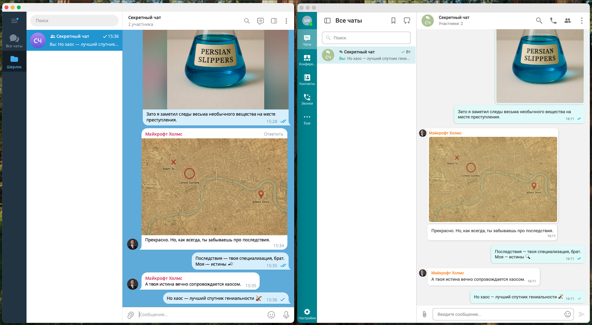
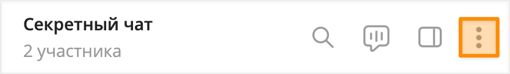
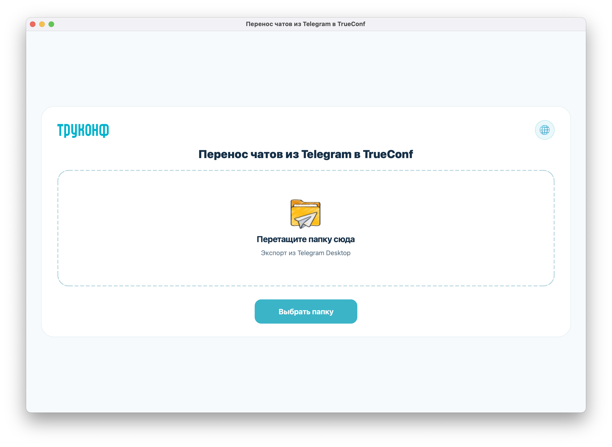
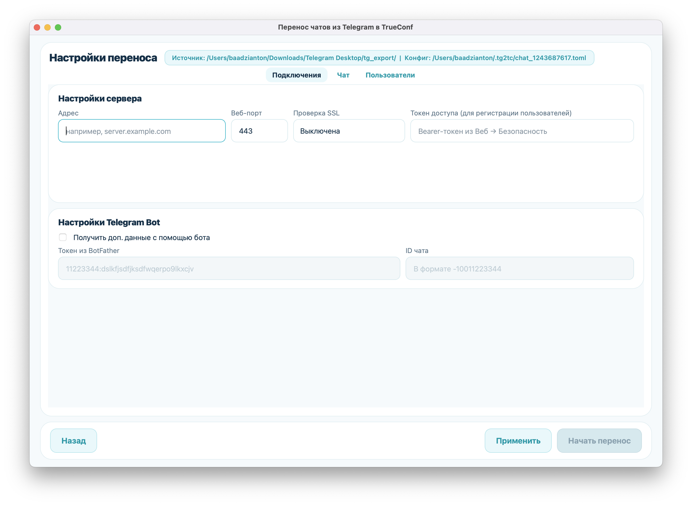
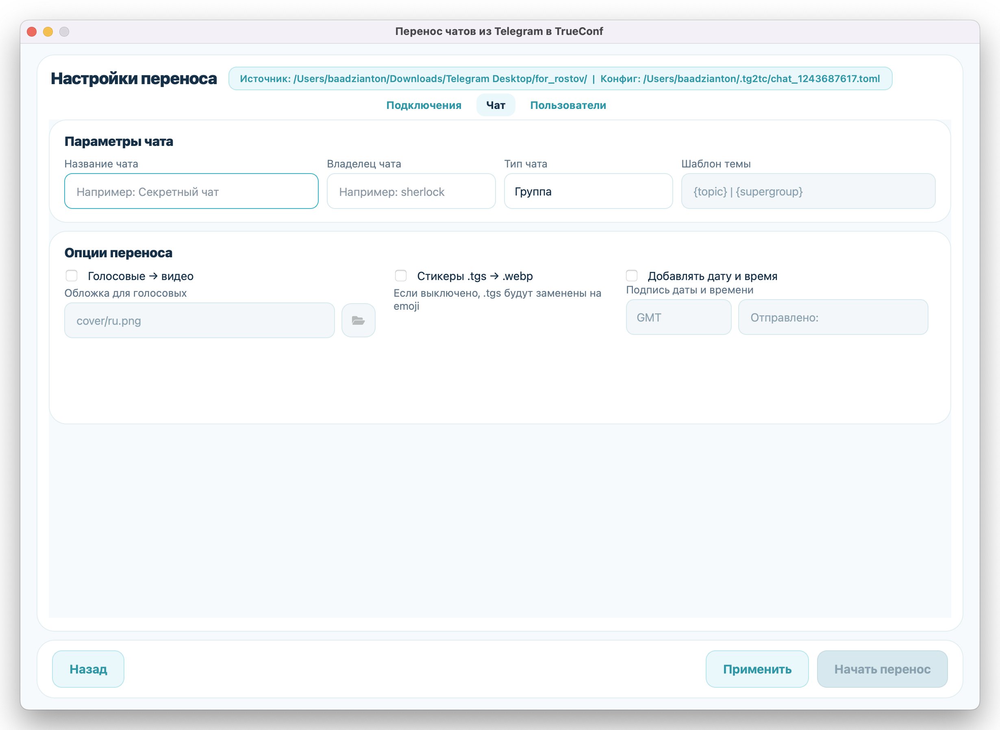
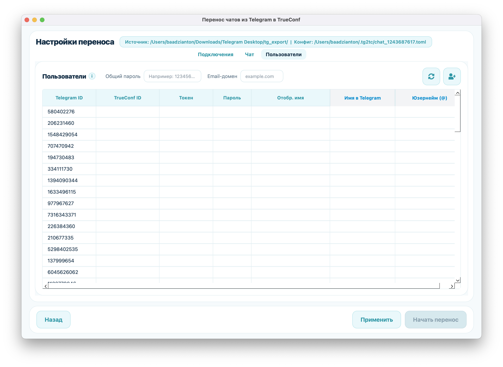
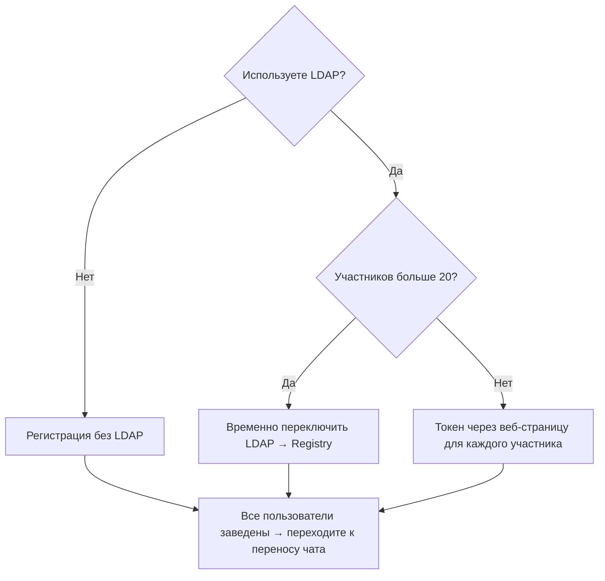
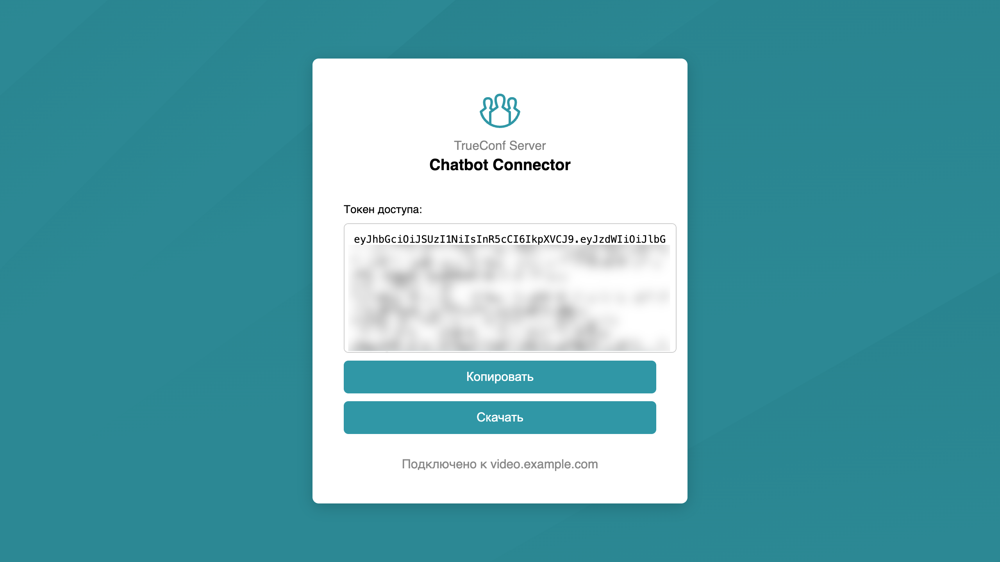

<p align="center">
  <a href="https://trueconf.ru" target="_blank" rel="noopener noreferrer">
    <picture>
      <source media="(prefers-color-scheme: dark)" srcset="https://raw.githubusercontent.com/TrueConf/.github/refs/heads/main/logos/logo-cyrillic-dark.svg">
      
    </picture>
  </a>
</p>

<h1 align="center">🛡️ Безопасный перенос чатов из Telegram в TrueConf</h1>

<p align="center">Нужен безопасный мессенджер без блокировок?
Тогда переноси все свои чаты из Telegram в TrueConf всего за пару кликов.
Поддержан перенос только в on-premise версии <a href="https://trueconf.ru/products/server/server-videokonferenciy.html">TrueConf Server</a> / <a href="https://trueconf.ru/products/enterprise/trueconf-enterprise.html">TrueConf Enterprise</a>.</p>

<p align="center">
     <a href="https://pypi.org/project/python-trueconf-bot" target="_blank">
      
</a>
    <a href="https://t.me/trueconf_chat" target="_blank">
        
    </a>
</p>

<p align="center">
  
</p>

<p align="center">
  <a href="README.md">English</a> /
  <a href="./README-ru.md">Русский</a>
</p>

> [!CAUTION]
> Данная инструкция применима к TrueConf Server версии 5.5.3 и выше. 
> Если у вас установлена более старая версия, то [обновите сервер](https://trueconf.ru/products/server/howto-update-trueconf-server.html).

## 🚀 Быстрый старт

Перенос состоит из шести шагов. Ниже — весь путь целиком, без деталей, чтобы вы понимали, где сейчас находитесь и сколько ещё осталось.

1. **Подготовьте окружение** — Telegram Desktop, TrueConf Server, Python 3.11+. → [Введение](#введение)
2. **Экспортируйте чат** из Telegram в формате JSON. → [Экспорт чата Telegram](#экспорт-чата-telegram)
3. **Скачайте и запустите** программу переноса. → [Установка и первый запуск](#установка-и-первый-запуск)
4. **Настройте подключение** к TrueConf Server и (опционально) бота Telegram для автоопределения участников. → [Вкладка «Подключения»](#вкладка-подключения)
5. **Сопоставьте участников чата с их TrueConf ID.** Если пользователей ещё нет на сервере — зарегистрируйте их (порядок действий зависит от того, используете ли вы LDAP). → [Вкладка «Пользователи»](#вкладка-пользователи)
6. **Запустите перенос** и получите копию чата в TrueConf. → [Перенос чата](#перенос-чата)

> [!TIP]
> Если какой-то термин ниже непонятен — загляните в раздел [«Термины»](#-термины) перед тем, как гуглить.

### 📖 Термины

| Термин | Что это |
|---|---|
| **TrueConf ID** | Логин пользователя в TrueConf Server, аналог username. |
| **LDAP** | Способ, при котором пользователи и пароли хранятся не на самом TrueConf Server, а в корпоративном каталоге (например, Active Directory). Если вы никогда не настраивали LDAP — скорее всего, он у вас не используется. |
| **Registry** | Режим, при котором пользователи и пароли хранятся прямо на TrueConf Server (без внешнего каталога). |
| **access_token** | Ключ доступа к API сервера. Нужен программе переноса, чтобы регистрировать пользователей от вашего имени. |
| **OAuth-приложение** | Способ выдать программе временный, ограниченный по правам токен доступа — безопаснее, чем постоянный токен администратора. |

---

## Введение

Для успешного переноса прежде всего:

1. Установите приложение [Telegram Desktop](https://desktop.telegram.org/).
2. Разверните [TrueConf Server](https://trueconf.ru/products/tcsf/besplatniy-server-videoconferenciy.html) версии 5.5.3 или выше:
   - [для Windows](https://trueconf.ru/blog/baza-znaniy/install-lan-videoconferencing-system) ([видео-инструкция](https://rutube.ru/video/7cf74e21db7b492ed7d0bf7e0190a68f/));
   - для Linux: [Debian](https://trueconf.ru/blog/baza-znaniy/kak-za-15-minut-razvernut-sistemu-videokonferenczij-na-baze-os-linux), [CentOS](https://trueconf.ru/blog/baza-znaniy/ustanovka-trueconf-server-na-centos-stream-9-linux-za-15-minut), [Astra Linux](https://trueconf.ru/blog/baza-znaniy/ustanovka-trueconf-server-na-os-astra-linux-se-za-15-minut), [Альт Сервер](https://trueconf.ru/blog/baza-znaniy/ustanovka-trueconf-server-na-alt-server-linux-za-15-minut), [РЕД ОС](https://trueconf.ru/blog/baza-znaniy/ustanovka-trueconf-server-na-red-os-linux-za-15-minut).
3. Установите на любой ПК (_не там где TrueConf Server_) [Python 3.11](https://docs.python.org/3/using/index.html) или выше.

> [!TIP]
> Данное open-source решение переносит чаты без оригинальной даты и времени отправки сообщения. Если для вас это критично, то обратитесь в [техническую поддержку](https://trueconf.ru/support.html) за помощью.

## Экспорт чата Telegram

После установки и авторизации в приложении Telegram Desktop вам станут доступны все ваши чаты.

> [!TIP]
> Если вы являетесь администратором организации и не имеете доступ к целевым перепискам, то вы можете попросить любого участника чата экспортировать историю вместо вас.

Для экспорта истории:

1. Перейдите в чат и его заголовке нажмите кнопку с тремя точками:

   <p align="center"></p>

2. В меню выберите пункт **Экспорт истории чата**.

3. В окне настроек экспорта:
   - отметьте галочками нужные вам медиа;
   - для файлов выставьте ограничение по размеру;
   - в формате укажите **JSON**;
   - укажите путь для сохранения или оставьте по умолчанию `Загрузки/Telegram Desktop/`;
   - настройте диапазон, например с первого сообщения до текущей даты, с 01.02.2022 12:00 по 03.03.2023 19:00 и т.д.

   <p align="center"></p>

4. Нажмите кнопку **Экспортировать**.

После этого начнётся сохранение чата с выбранными настройками. Данное окно можно закрыть, если оно вам мешает.

> [!CAUTION]
> Дождитесь полного завершения операции. Если вы выбрали диапазон дат и видите, что сообщения выгружены, не отменяйте процесс, чтобы избежать повреждения файла.

## Установка и первый запуск

1. На главной странице репозитория нажмите кнопку **Code** → **Download ZIP**.
2. Распакуйте архив в любую директорию на вашем ПК.

### Python

Для работы скриптов у вас должен быть установлен Python 3.11 или выше.

- **Windows** — скачайте с [официального сайта](https://www.python.org/).
- **Linux и macOS** — как правило, Python уже предустановлен.

Проверьте вашу версию командой:

```bash
> python --version
Python 3.12.4
```

> [!IMPORTANT]
> Если версия ниже 3.11 — обновите Python, иначе скрипт не запустится.

### Настройка окружения

Создайте виртуальное окружение и установите зависимости (предпочтительно через [uv](https://docs.astral.sh/uv/)):

```bash
uv sync
```

### Запуск программы

Запустите программное обеспечение командой в терминале:

```bash
uv run main.py
```

У вас откроется окно:

<p align="center">
   
</p>

Выберите или перетащите папку с экспортом в выделенную область.

## Настройка переноса

### Вкладка «Подключения»

<p align="center">
   
</p>

1. **Настройки сервера TrueConf:**

   - адрес сервера: доменное имя или IP-адрес;
   - веб-порт, используемый для HTTPS-соединения (по умолчанию `443`);
   - проверка SSL-сертификата: **включена** для доверенных сертификатов, **выключена** для самоподписанных;
   - токен доступа из **Веб → Безопасность**. Нужен только для регистрации пользователей, если у вас новая инсталляция без учётных записей.

1. **Настройки бота Telegram** *(опционально, но рекомендуется при большом числе участников)*.

   Эти настройки нужны для автоматического получения **@username** и **реального имени** участника Telegram-чата — это упрощает сопоставление с существующим TrueConf ID.

   1. Создайте бота через [BotFather](https://t.me/BotFather) и укажите его токен в поле **Токен из BotFather**.
   2. Добавьте бота в чат и выдайте ему права администратора.
   3. С помощью бота [@userinfobot](https://t.me/userinfobot) определите ID чата и укажите его в соответствующем поле.

> [!TIP]
> Кнопка **Применить** сохраняет настройки, так что вы можете готовиться к переносу чата в течение продолжительного времени.

### Вкладка "Чат"

На вкладке **Чат** укажите следующие настройки:

<p align="center">
   
</p>

#### Параметры чата

Укажите:

- название нового чата;
- владельца чата (желательно указать TrueConf ID; этот пользователь должен быть в таблице на вкладке **Пользователи**);
- тип чата — для группы с темами (топик, форум) выберите **Супергруппа** и укажите **Шаблон темы**.

> [!CAUTION]
> Не изменяйте значения подстановочных переменных `{topic}` или `{supergroup}`.
> Вы можете задать свой формат, например поменять их местами `{supergroup} | {topic}` или убрать `{supergroup}`.
> По умолчанию название подгруппы будет таким: `Название топика | Название чата`.

#### Опции переноса

#### Конвертация голосовых сообщений

TrueConf не поддерживает формат **ogg**, используемый в Telegram. Голосовые сообщения можно автоматически конвертировать в видео формата **mp4** с обложкой (её можно заменить на свою) — тогда их можно будет слушать через встроенный просмотрщик TrueConf. В правом нижнем углу обложки будет добавлен источник и время записи оригинала.

<p align="center">

</p>

> [!IMPORTANT]
> 🧩 Требуется установленный FFmpeg (добавлен в PATH) с поддержкой фильтра drawtext.
> Перед включением функции проверьте готовность системы:
>
> ```bash
> uv run check_ffmpeg.py
> ```
>
> Если проверка прошла успешно (`FFmpeg OK ✅`) — можно включать конвертацию в настройках.

#### Конвертация анимированных стикеров

Анимированные стикеры Telegram хранятся в формате **.tgs** — это архив с анимацией [lottie](https://lottie.github.io/). Их можно сконвертировать в формат **webp**, который поддерживает TrueConf. Если конвертацию не включать, такие сообщения будут отправлены как обычные emoji.

> [!IMPORTANT]
> 🧩 *Актуально только если вы хотите включить конвертацию стикеров.* Для работы конвертации нужны системные библиотеки — без них шаг можно пропустить.

<details>
<summary><b>Установка на Windows (нужна библиотека Cairo)</b></summary>

Установите [MSYS2](https://www.msys2.org/), затем:

1. Обновите пакеты:

   ```bash
   pacman -Syu
   ```

2. Если консоль в конце напишет что-то вроде `warn: terminate MSYS2 without returning to shell and check for updates again` — просто перезапустите терминал и повторите команду.

3. Установите библиотеку:

   ```bash
   pacman -S mingw-w64-x86_64-cairo
   ```

</details>

### Дата и время сообщений

Эта версия программы не переносит сообщения с оригинальным временем отправки — все сообщения отправляются с временем работы скрипта. Если оригинальное время для вас критично, у вас два варианта:

- включить флажок, настроить часовой пояс и подпись — тогда к каждому сообщению будет добавлена текстовая подпись вида `Отправлено: 01.09.2025 14:10:00 +0300`;
- обратиться в [техническую поддержку TrueConf](https://trueconf.ru/support.html) за помощью.

### Вкладка «Пользователи»

<p align="center">
   
</p>

Для каждого Telegram ID укажите корректный TrueConf ID (логин). Столбцы **Пароль** и **Отобр. имя** нужны только для регистрации новых пользователей на сервере. Столбцы **@username** и **Реальное имя** заполняются автоматически при [интеграции с Telegram-ботом](#вкладка-подключения) — кнопкой .

> [!WARNING]
> Для автозаполнения нужна связь с серверами Telegram. Если видите ошибку — проверьте, включены ли у вас средства обхода блокировок.

Если каких-то пользователей ещё нет на TrueConf Server — их нужно зарегистрировать. **Какой раздел читать дальше, зависит от вашей инфраструктуры:**


```mermaid
flowchart TD
    A{Используете LDAP?} -->|Нет| B[Регистрация без LDAP]
    A -->|Да| C{Участников больше 20?}
    C -->|Да| D[Временно переключить LDAP → Registry]
    C -->|Нет| E[Токен через веб-страницу для каждого участника]
    B --> F[Все пользователи заведены → переходите к переносу чата]
    D --> F
    E --> F
```

- **Нет LDAP** → читайте [«Регистрация пользователей в TrueConf Server (без LDAP)»](#регистрация-пользователей-в-trueconf-server-без-ldap).
- **LDAP, участников больше 20** → читайте [«Для настроенной инфраструктуры (при использовании LDAP)»](#для-настроенной-инфраструктуры-при-использовании-ldap) — самый быстрый путь: временно переключиться на Registry.
- **LDAP, участников немного или переключиться на Registry нельзя** → читайте [«Получение токена для авторизации в API чатов»](#получение-токена-для-авторизации-в-api-чатов-если-невозможно-переключиться-с-ldap-на-registry).

#### Регистрация пользователей в TrueConf Server (без LDAP)

> [!NOTE]
> Этот раздел — если вы **не используете LDAP**. Если у вас настроен LDAP — переходите сразу к следующему разделу.

Для переноса чата все участники должны быть зарегистрированы в TrueConf Server. Без LDAP это можно сделать прямо на вкладке **Пользователи**:

1. Укажите для каждого пользователя TrueConf ID, отображаемое имя и Email-домен.
2. Чтобы ускорить процесс, задайте всем общий пароль в поле **Пароль для регистрации**.
3. Получите `access_token` API TrueConf Server одним из двух способов:

   **Способ А. Из панели управления.** Раздел **Веб → Безопасность** → скопировать токен API.
   > [!CAUTION]
   > Такой токен не имеет срока действия, даёт доступ ко всему API сервера и должен храниться как секрет администратора.

   **Способ Б. Через OAuth-приложение (рекомендуется).** Создайте [OAuth-приложение](https://trueconf.ru/docs/server/ru/admin/api/), выдайте только нужные права и выполните запрос к `https://domain.name/api/v4/token`, чтобы обменять `client_id` и `client_secret` на `access_token`.
   > [!NOTE]
   > OAuth-токен по умолчанию действует 1 час — безопаснее для миграционных сценариев.

4. Вставьте токен в поле **Токен доступа (для регистрации пользователей)** на вкладке **Подключения** и нажмите **Применить**.
5. Нажмите кнопку регистрации  в правом верхнем углу.

Для каждого пользователя вы получите один из статусов:

```
✅ Успешное добавление
⚠️ Пользователь уже существует
🔴 Ошибка
```

#### Для настроенной инфраструктуры (при использовании LDAP)

> [!NOTE]
> 🧩 Этот раздел — если у вас настроен **LDAP** и участников **больше 20**.

Ручной сбор токена для каждого пользователя при большом чате слишком трудоёмок. Проще временно переключить TrueConf Server с LDAP на Registry, зарегистрировать пользователей автоматически, перенести чат и переключить сервер обратно. Рекомендуем делать это в нерабочее время.

Порядок действий:

1. Укажите общий пароль для всех в поле **Пароль для регистрации**.
2. Для каждого пользователя (Telegram ID) укажите корректный TrueConf ID.
3. В нерабочее время временно переведите TrueConf Server из режима **LDAP** в режим **Registry** — **без автоматической миграции пользователей**.
4. Зарегистрируйте пользователей, как описано в разделе [«Регистрация пользователей в TrueConf Server (без LDAP)»](#регистрация-пользователей-в-trueconf-server-без-ldap).
5. Выполните [миграцию чата](#перенос-чата).
6. После успешного завершения миграции переключите сервер обратно на **LDAP**.

Если переключиться на Registry нельзя даже ненадолго — используйте следующий раздел.

#### Получение токена для авторизации в API чатов (если невозможно переключиться с LDAP на Registry)

> [!NOTE]
> 🧩 Этот раздел — если у вас настроен **LDAP** и переключение на Registry невозможно.

Для авторизации в API чатов нужен `Токен`. Обычно его получают POST-запросом с логином и паролем учётной записи TrueConf Server (см. [документацию](https://trueconf.ru/docs/chatbot-connector/ru/connect-and-auth/#access-token)). Но при LDAP администратор, как правило, не знает паролей пользователей — их аутентификация идёт через домен. Запрашивать у сотрудников пароль от корпоративной учётной записи небезопасно: это всё равно что просить "ключи от квартиры, где деньги лежат" (знаменитая фраза Остапа Бендера из романа «Двенадцать стульев» Ильи Ильфа и Евгения Петрова).

Поэтому команда TrueConf подготовила [HTML-страницу](chatbot/ru/index.html), которая позволяет каждому пользователю получить токен самостоятельно, не сообщая пароль администратору.

**Шаг 1. Разместите страницу на веб-сервере TrueConf**

1. Скопируйте папку [`chatbot`](chatbot):

   **Windows (PowerShell):**
   ```shell
   Copy-Item -Path "D:\chatbot" -Destination "C:\Program Files\TrueConf Server\httpconf\site" -Recurse
   ```

   **Linux:**
   ```shell
   sudo cp ~/chatbot /opt/trueconf/server/srv/site/
   ```

2. Перезапустите службу **TrueConf Web Manager**:

   **Windows (PowerShell):**
   ```shell
   Restart-Service -Name "TrueConf Web Manager"
   ```

   **Linux:**
   ```shell
   sudo systemctl restart trueconf-web
   ```

> [!CAUTION]
> При обновлении TrueConf Server директория `chatbot` будет удалена с сервера — при необходимости повторите шаг 1 после обновления.

**Шаг 2. Попросите каждого участника получить токен**

1. Открыть в браузере `https://server.address/chatbot/ru/index.html`.
2. Ввести TrueConf ID и пароль, нажать **Получить токен**.

   <p align="center">
     
   </p>

3. Скопировать или скачать полученный токен и передать его администратору.

   <p align="center">
     
   </p>

**Шаг 3. Внесите токены в программу**

Заполните столбец `Токен` в разделе **Пользователи** для каждого участника.

> [!IMPORTANT]
> Убедитесь, что токен вставлен именно в строку того пользователя, которому он принадлежит — иначе при переносе сообщения могут быть отправлены от чужого имени.

После заполнения токенов для всех участников — переходите к [переносу чата](#перенос-чата).

## Перенос чата

1. Сохраните настройки кнопкой **Применить** — после этого кнопка **Начать перенос** станет активна.
2. Нажмите **Начать перенос**.

> [!WARNING]
> Для чатов с типом `группа`,`супергруппа` и `канал` при каждом запуске переноса будет создаваться новый экземпляр чата.

В случае успешного переноса у вас появится копия чата Telegram:

🎬 [Посмотреть видео на YouTube](https://youtu.be/Vvz_ZpuO3DU)

## ❓ Частые проблемы

| Проблема | Что проверить |
|---|---|
| При автозаполнении **@username** — ошибка | Нет связи с серверами Telegram: проверьте средства обхода блокировок. |
| Регистрация пользователя возвращает `🔴 Ошибка` | Проверьте, что `access_token` актуален (у OAuth-токена срок жизни 1 час) и что TrueConf ID указан без опечаток. |
| Голосовые сообщения не конвертируются | Проверьте `uv run check_ffmpeg.py` — FFmpeg должен быть в PATH и поддерживать фильтр drawtext. |
| Стикеры не конвертируются | Проверьте, установлена ли системная библиотека Cairo (Windows) — см. раздел про конвертацию стикеров. |
| Сообщения переносятся не от того пользователя | Проверьте, что токен в столбце **Токен** привязан к правильной строке участника. |

Если проблема не решается — обратитесь в [техническую поддержку TrueConf](https://trueconf.ru/support.html).
