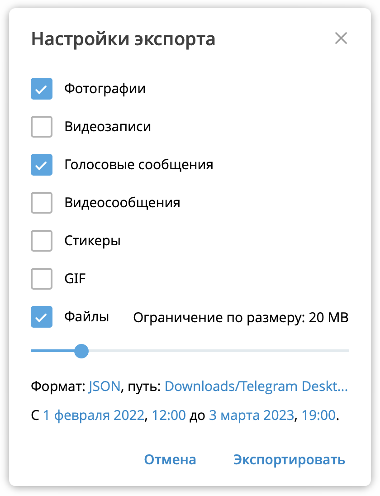
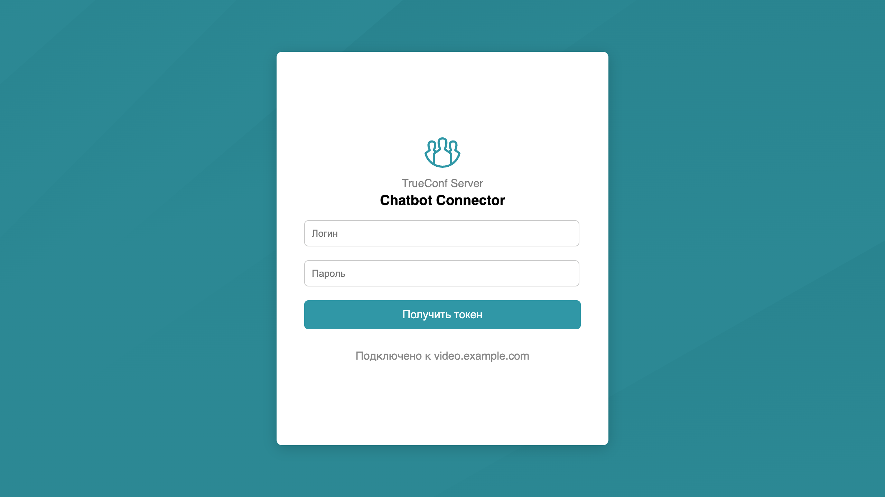

<p align="center">
  <a href="https://trueconf.ru" target="_blank" rel="noopener noreferrer">
    <picture>
      <source media="(prefers-color-scheme: dark)" srcset="https://raw.githubusercontent.com/TrueConf/.github/refs/heads/main/logos/logo-cyrillic-dark.svg">
      
    </picture>
  </a>
</p>

<h1 align="center">🛡️ Безопасный перенос чатов из Telegram в TrueConf</h1>

<p align="center">Нужен безопасный мессенджер без блокировок?
Тогда переноси все свои чаты из Telegram в TrueConf всего за пару кликов.
Поддержан перенос только в on-premise версии <a href="https://trueconf.ru/products/server/server-videokonferenciy.html">TrueConf Server</a> / <a href="https://trueconf.ru/products/enterprise/trueconf-enterprise.html">TrueConf Enterprise</a>.</p>

<p align="center">
     <a href="https://pypi.org/project/python-trueconf-bot" target="_blank">
      
</a>
    <a href="https://t.me/trueconf_chat" target="_blank">
        
    </a>
</p>

<p align="center">
  
</p>


<p align="center">
  <a href="README.md">English</a> /
  <a href="./README-ru.md">Русский</a>
</p>

## Введение

Для успешного переноса прежде всего:

1. Установите приложение [Telegram Desktop](https://desktop.telegram.org/).
2. Разверните [TrueConf Server](https://trueconf.ru/products/tcsf/besplatniy-server-videoconferenciy.html) версии 5.5 или выше:
   - [для Windows](https://trueconf.ru/blog/baza-znaniy/install-lan-videoconferencing-system) ([видео-инструкция](https://rutube.ru/video/7cf74e21db7b492ed7d0bf7e0190a68f/));
   - для Linux: [Debian](https://trueconf.ru/blog/baza-znaniy/kak-za-15-minut-razvernut-sistemu-videokonferenczij-na-baze-os-linux), [CentOS](https://trueconf.ru/blog/baza-znaniy/ustanovka-trueconf-server-na-centos-stream-9-linux-za-15-minut), [Astra Linux](https://trueconf.ru/blog/baza-znaniy/ustanovka-trueconf-server-na-os-astra-linux-se-za-15-minut), [Альт Сервер](https://trueconf.ru/blog/baza-znaniy/ustanovka-trueconf-server-na-alt-server-linux-za-15-minut), [РЕД ОС](https://trueconf.ru/blog/baza-znaniy/ustanovka-trueconf-server-na-red-os-linux-za-15-minut).
3. Установите на любой ПК (_не там где TrueConf Server_) [Python 3.11](https://docs.python.org/3/using/index.html) или выше.

После этого мы покажем как с щепоткой терпения перенести чаты по таким шагам:

1. [Экспортировать чат Telegram](#экспорт-чата-telegram).
2. [Настроить конфигурационный файл](#настройка-конфигурационного-файла).
3. При [необходимости создать](#автоматическое-добавление-пользователей-в-trueconf-server) заранее учётные записи пользователей на сервере видеосвязи.
4. [Запустить скрипт](#перенос-чата).

## Скачивание репозитория и настройка окружения

Для скачивания файлов/скриптов на главной странице репозитория нажмите кнопку **Code** и выберите **Download ZIP**. После чего распакуйте архив в какую-то директорию.

### Python

Для работы с подготовленными скриптами у вас должен быть установлен Python 3.11 или выше. Для Windows вы можете скачать его с [официального сайта](https://www.python.org/). В Linux и macOS как правило Python уже предустановлен. Проверьте вашу версию с помощью команды:

```bash
> python --version
Python 3.12.4
```

> [!IMPORTANT]
> В случае необходимости обновите вашу версию, иначе скрипт не сработает.

### Настройка окружения

Создайте виртуальное окружение и установите зависимости (препочтительно через [uv](https://docs.astral.sh/uv/)): 

 ```bash
 uv sync
 ```

## Экспорт чата Telegram

После установки и авторизации в приложении Telegram Desktop вам станут доступны все ваши чаты.

> [!TIP]
> Если вы являетесь администратором организации и не имеете доступ к целевым перепискам, то вы можете попросить любого участника чата экспортировать историю вместо вас.

Для экспорта истории:

1. Перейдите в чат и его заголовке нажмите кнопку с тремя точками:

<p align="center"></p>

2. В меню выберите пункт **Экспорт истории чата**.

3. В окне настроек экспорта:

   - отметьте галочками нужные вам медиа;
   - для файлов выставьте ограничение по размеру;
   - в формате укажите **JSON**;
   - укажите путь для сохранения или оставьте по умолчанию `Загрузки/Telegram Desktop/`;
   - настройте диапазон, например с первого сообщения до текущей даты, с 01.02.2022 12:00 по 03.03.2023 19:00 и т.д.

<p align="center"></p>

4. Нажмите кнопку **Экспортировать**.

После чего начнется сохранение чата с выбранными настройками. Данное окно можно закрыть, если оно вам мешает.

> [!CAUTION]
> Дождитесь полного завершения операции. Если вы выбрали диапазон дат и видите, что сообщения выгружены, не отменяйте процесс, чтобы избежать повреждения файла.

## Настройка конфигурационного файла

### Описание 

> [!NOTE]
> Мы используем настройку конфигурации с помощью языка [TOML](https://toml.io/).

Откройте файл `config.toml`. В нем вы увидите следующую структуру: 

```toml
telegram_export_dir = ""

[telegram_bot]
token = ""
chat_id = ""

[server]
address = "" # IP or domain.name
web_port = 443
verify_ssl = false # or true if needed
access_token = ""

[chat]
type = "" # available: personal, group, channel, supergroup
name = ""
supergroup_topic_name_template = "{topic} | {supergroup}" # only for supergroup. Available: topic – topic's name, supergroup's name from name param
owner = "" # who created chat

[chat.datetime]
view_original_time_in_message = false # or true if needed
timezone = "GMT" # need if view_original_time_in_message = true
caption = "" # example: f"{caption}{dt}"

[chat.voice_message]
convert_voice_message_to_video = false
cover_image = "cover/en.png" # by default "cover/en.png"

[registration]
auto = false # or true if needed
email_domain = "" # If it does not exist, the external server name will be substituted.
default_password = ""

[users]

[users.trueconf_id]
display_name = ""
password = ""
access_token = ""
telegram_id = ""
type = ""
```

Для успешного переноса вам необходимо заполнить конфигурационный файл по следующему описанию: 

| Секция             | Параметр                          | Описание                                                                                                                                                                                                                                                                                                 |
|--------------------|-----------------------------------|----------------------------------------------------------------------------------------------------------------------------------------------------------------------------------------------------------------------------------------------------------------------------------------------------------|
|                    | telegram_export_dir               | Путь к папке с экспортированным Telegram-чатом                                                                                                                                                                                                                                                           |
| telegram_bot       |                                   |                                                                                                                                                                                                                                                                                                          |
|                    | token                             | Токен бота из [@BotFather](https://t.me/BotFather)                                                                                                                                                                                                                                                       |
|                    | chat_id                           | ID чата. Можно узнать через [@userinfobot](https://t.me/userinfobot)                                                                                                                                                                                                                                     |
| server             |                                   | Настройки TrueConf Server                                                                                                                                                                                                                                                                                |
|                    | address                           | Доменное имя или IP-адрес TrueConf Server                                                                                                                                                                                                                                                                |
|                    | web_port                          | Используемый HTTPS-порт. По умолчанию `443`.                                                                                                                                                                                                                                                             |
|                    | verify_ssl                        | Проверка SSL-сертификата. `true`, если у вас доверенный сертификат.                                                                                                                                                                                                                                      |
|                    | access_token                      | Токен безопасности для доступа к API.                                                                                                                                                                                                                                                                    |
| chat               |                                   | Настройки нового чата в TrueConf Server                                                                                                                                                                                                                                                                  |
|                    | name                              | Название чата                                                                                                                                                                                                                                                                                            |
|                    | type                              | Тип чата: `personal` (чат на двоих), `group` (групповой), `channel` (канал), `supergroup` (групповой чат с формумом (темы, топики)).                                                                                                                                                                     |
|                    | supergroup_topic_name_template    | Шаблон названия переносимого форума в TrueConf                                                                                                                                                                                                                                                           |
|                    | owner                             | Создатель (для `personal`) и владелец чата (для `group`, `supergroup` и `channel`)                                                                                                                                                                                                                       |
| chat.datetime      |                                   | Настройки отображения оригинальной даты и времени отправки сообщения в Telegram.                                                                                                                                                                                                                         |
|                    | view_original_time_in_message     | Если `true`, то в каждое текстовое сообщение будет добавляться дата и время отправки.                                                                                                                                                                                                                    |
|                    | timezone                          | Настройка часового пояса. Требуется указать корректный часовой пояс для большинства пользователей в чате. По умолчанию `GMT` (UTC).                                                                                                                                                                      |
|                    | caption                           | При желании вы можете добавить подпись перед датой и временем. Например, `Отправлено:` или `Дата:`.                                                                                                                                                                                                      |
| chat.voice_message |                                   | Настройки переноса голосовых сообщений                                                                                                                                                                                                                                                                   |
|                    | convert_voice_message_to_video    | Если `true`, то все голосовые сообщения будут сконвертированы в видео формата `mp4`. Нужен предустановленный пакет [ffmpeg](https://ffmpeg.org/).                                                                                                                                                        |
|                    | cover_image                       | Если `convert_voice_message_to_video = true`, то будет использована указанная заглушка.                                                                                                                                                                                                                  |
|                    | data_time                         | Если `true`, то в **текстовое сообщение** будет добавлено дата и время отправки оригинального сообщения из Telegram.                                                                                                                                                                                     |
| chat.stickers      |                                   |                                                                                                                                                                                                                                                                                                          |
|                    | convert_telegram_stickers_to_webp | Если `true`, то каждый анимированный стикер Telegram (**.tgs**) будет сконвертирован в **webp**. Нужны системные библиотеки в ОС. Если `false`, то стикер заменяется на эмоджи.                                                                                                                          |
| registration       |                                   | Настройки автоматического добавления пользователей на TrueConf Server.                                                                                                                                                                                                                                   |
|                    | auto                              | Если `true`, то в [users] при использовании `parse_users.py` будут добавляться параметры `display_name` и `password`.                                                                                                                                                                                    |
|                    | email_domain                      | В случае использования корпоративной почты, нужно указать домен, который будет использоваться в поле `email` при автоматическом добавлении пользователя. Например, вы используете домен `mail.example.com`, то при добавлении пользователя `user` у него будет адрес эл. почты – `user@mail.example.com` |
|                    | default_password                  | Общий пароль для всех учетных записей. Автозаполнение параметра `password` при использовании скрипта `parse_users.py`.                                                                                                                                                                                   |
| users              |                                   | Раздел с настройкой учетных записей пользователей (участников чата). Можно заполнить автоматически с помощью `parse_users.py`.                                                                                                                                                                           |
|                    | display_name, password            | Автоматически заполняются, если `registration.auto = true`. Необходимо для автоматического добавления пользователей с помощью `add_users_to_server.py`                                                                                                                                                   |
|                    | telegram_id, type                 | Цифровой Telegram ID и тип пользователя (`user`,`channel`). Автоматически заполняются при использовании `parse_users.py`.                                                                                                                                                                                |
|                    | access_token                      | Авторизационный токен пользователя в TrueConf Chatbot Connector (_TTL = 1 мес._). Необходим, для переноса чатов. Если не указан, используется `password`.                                                                                                                                                |

> [!TIP]
> **Так много параметров нужно заполнить 🤯?** На самом деле – нет. Для упрощения данного процесса, мы подготовили скрипты, о чем рассказано ниже.

### Автоматический сбор пользователей

Если Telegram-чат имеет внушительное количество участников, то заполнение конфиг файла приводит в уныние :cry:. 
Поэтому, команда Труконф подготовила скрипт [parse_users.py](parse_users.py) для автоматического заполнения раздела `[users]`.

> [!NOTE]
> **Что делает скрипт?** Он анализирует файл `result.json` (из экспорта) и формирует список пользователей.

1. В `config.toml` укажите путь к папке с экспортированным чатом:

   ```toml
   telegram_export_dir = "~/Downloads/Telegram Desktop/ChatExport_2025-09-05"
   ```

2. Для сбора дополнительных данных, например, `username` и имя пользователя, 
   которое он сам задал себе (`real_display_name`) рекомендуем создать бота через [@BotFather](https://t.me/BotFather).
   Далее `config.toml` укажите токен бота и ID целевого чата (можно узнать с помощью [@userinfobot](https://t.me/userinfobot)).

2. После ввода всех необходимых данных запустите скрипт в настроенном окружении: 

   ```shell
   uv run parse_users.py
   ```

3. В случае успеха вы получите оповещение об успешном обновлении файла конфигурации: 

   ```shell
   File 'config.toml' updated successfully
   ```

4. В `config.toml` в `[users]` у вас будут собраны все участники со следующими параметрами:

   ```toml
   [users]
   [users.ivanov_ivan]
   access_token = ""
   trueconf_id = ""
   telegram_id = "12345678"
   type = "user"
   ```

В случае, если вы будете запускать автоматическое добавление пользователей на TrueConf Server, то в `config.toml` укажите следующие параметры:

```toml
[registration]
auto = true # Обязательно
email_domain = "mail.example.com" # Опционально (см. описание)
default_password = "12345678" # Опционально (см. описание)
```

и перезапустите скрипт.

### Автоматическое добавление пользователей в TrueConf Server (без LDAP)

Для переноса переписок из Telegram в TrueConf необходимо, чтобы все пользователи участвующие в общении были зарегистрированы в TrueConf Server.
Если вы **не используете LDAP**, то вы можете воспользоваться скриптом [add_users_to_server.py](add_users_to_server.py) для автоматической регистрации.

> [!IMPORTANT]
> В случае настроенной инфраструктуры перейдите к следующему разделу.

Перед запуском скрипта удостоверьтесь, что все данные в блоке `[users]` удовлетворяют вашим ожиданиям.
Укажите необходимый TrueConf ID (до @), при необходимости скорректируйте  отображаемое имя (`display_name`) и пароль (`password`):

   ```toml 
   #Пример:
   [users.vanya_ivanov]
   trueconf_id = "ivan_ivanov"
   display_name = "Иван Иванов"
   password = "verystrongpassword1357"
   ```

> [!NOTE]
> Перепроверьте всех новых пользователей. Если вы вдруг допустили ошибку, то можете удалить всех созданных пользователей с помощью `delete_users_from_server.py` и повторить процесс регистрации заново.

Также для работы скрипта потребуется access_token для доступа к API TrueConf Server. Получить его можно одним из следующих способов:

1. В панели управления TrueConf Server.

   Перейдите в раздел **Веб → Безопасность** и скопируйте токен API.

> [!CAUTION]
> Такой токен не имеет срока действия по умолчанию, предоставляет доступ ко всему API сервера и должен храниться как секрет администратора.

2. Через OAuth-приложение (рекомендуется).

   Создайте [OAuth-приложение](https://trueconf.ru/docs/server/ru/admin/api/), выдайте ему только необходимые права и выполните запрос к `https://domain.name/api/v4/token`, чтобы обменять `client_id` и `client_secret` на `access_token`.

> [!NOTE]
> OAuth-токен по умолчанию действует 1 час, что делает этот вариант более безопасным для миграционных и автоматизированных сценариев.

После проверки всех данных запустите скрипт:

```shell
uv run add_users_to_server.py
```

Для каждого пользователя вы получите ответ типа:

```
Успешное добавление:
✅ User has been added to the server

Пользователь уже существует:
⚠️ User already exists on the server

Ошибка:
🔴 Error for user
```

### Для настроенной инфраструктуры (при использовании LDAP)

Если в вашей инфраструктуре используется LDAP и требуется перенести чат с большим количеством участников — более 20 человек, — ручной сбор `access_token` для каждого пользователя может оказаться слишком трудоёмким и неудобным. 
В таком случае рекомендуем выполнять перенос в нерабочее время: временно переключить TrueConf Server с **LDAP** на **Registry**. 
После этого можно воспользоваться скриптом `add_users_to_server.py`, как описано в разделе «[Автоматическое добавление пользователей в TrueConf Server (без LDAP)](#автоматическое-добавление-пользователей-в-trueconf-server-без-ldap))», 
добавить нужных пользователей на сервер и выполнить миграцию чата. 
Когда перенос будет завершён, сервер можно снова переключить обратно на LDAP. 
Если же переход на Registry даже на короткое время невозможен, воспользуйтесь инструкцией из следующего раздела.

Рекомендуем следующий порядок действий:

1. В `config.toml` заранее включите автоматическую регистрацию и задайте базовый пароль (доп. информация в [разделе](#автоматический-сбор-пользователей)):

   ```toml
   [registration]
   auto = true
   default_password = "12345678"
   ```

2. Запустите `parse_users.py`, чтобы автоматически заполнить секцию `[users]`.

3. Вручную укажите для пользователей корректный `trueconf_id`:

   ```toml
   [users.vanya_ivanov]
   trueconf_id = "ivan_ivanov"
   telegram_id = "44556677"
   password = "12345678"
   ```
   
4. В нерабочее время временно переведите TrueConf Server из режима **LDAP** в режим **Registry** без _автоматической миграции пользователей_.
5.	Зарегистрируйте пользователей на сервере с помощью скрипта `add_users_to_server.py`.
6.	Выполните [миграцию чата](#перенос-чата).
7.	После успешного завершения миграции переключите сервер обратно на **LDAP**.

Если переключение на **Registry** невозможно даже на короткое время, используйте инструкцию из следующего раздела.

### Получение `access_token` для авторизации в API чатов (если невозможно переключиться с LDAP на Registry)

Для авторизации в API чатов требуется `access_token`. Чтобы его получить, необходимо отправить **POST-запрос** с логином и паролем учетной записи TrueConf Server (см. [документацию](https://trueconf.ru/docs/chatbot-connector/ru/connect-and-auth/#access-token)). 

Однако в инфраструктуре с LDAP возникает практическая проблема: 
администратор TrueConf Server, как правило, не знает паролей пользовательских учётных записей, поскольку аутентификация выполняется через доменную учётную запись. 
Запрашивать у сотрудников их пароль от корпоративной учётной записи небезопасно и недопустимо, так как фактически это означает запрашивать доступ к их доменному аккаунту (все равно, что попросить "ключи от квартиры, где деньги лежат".)

Поэтому команда Труконф подготовила [HTML-страницу](chatbot/ru/index.html), которая упростит данный процесс. Что с ней делать? Просто добавить на TrueConf Server или на нужную ноду TrueConf Enterprise.

#### Добавление страницы на веб-сервер TrueConf

1. Скопируйте папку [`chatbot`](chatbot) по пути: 

   **Windows (PowerShell):** 

   ```shell
   Copy-Item -Path "D:\chatbot" -Destination "C:\Program Files\TrueConf Server\httpconf\site" -Recurse
   ```

   **Linux:** 

   ```shell
   sudo cp ~/chatbot /opt/trueconf/server/srv/site/
   ```

2. Перезагрузите службу **TrueConf Web Manager**:
   
   **Windows (PowerShell):** 

   ```shell
   Restart-Service -Name "TrueConf Web Manager"
   ```

   **Linux:** 

   ```shell
   sudo systemctl restart trueconf-web
   ```

> [!CAUTION]
> При обновлении TrueConf Server директория `chatbot` будет удалена с сервера.

#### Инструкция по получению токена 

Попросите каждого пользователя, которого добавляете в чат, получить access_token следующим образом:

1. В браузере перейдите по адресу `https://server.address/chatbot/ru/index.html`. 
   Укажите логин (TrueConf ID) и пароль в полях ввода и нажмите **Получить токен**:

   <p align="center">
     
   </p>

2. В случае успеха у вас отобразится токен. Скопируйте или скачайте его файлом для дальнейшей передачи вашему администратору:

   <p align="center">
     
   </p>

#### Что делать с `access_token` после получения

После того как пользователи получили свои `access_token`, администратору необходимо внести их в файл `config.toml` в секцию [users] для соответствующих участников.

Для каждого пользователя заполните поле `access_token` в его блоке:

```toml
[users.vanya_ivanov]
trueconf_id = "ivan_ivanov"
access_token = "eyJhbGciOiJIUzI1NiIsInR5cCI6IkpXVCJ9..."
telegram_id = "12345678"
```

> [!IMPORTANT]
> Важно убедиться, что токен вставлен в блок именно того пользователя, которому он принадлежит, иначе при переносе сообщения могут быть отправлены от неверного имени.

После того как поле access_token будет заполнено для всех участников, можно переходить к следующему этапу — [переносу чата](#перенос-чата).


## Перенос чата

Вот вы и добрались до этого шага! Для успешного переноса в конфиге укажите название, тип и владельца чата: 

```toml
[chat]

#Пример
name = "Секретный чат"
type = "group" # available: personal, group, channel, supergroup
owner = "sherlock" # who created chat
```

### Синхронизация даты и времени

По умолчанию в TrueConf Server нет возможности отправить сообщение задним числом. 
Если вам важно видеть дату и время отправки оригинального сообщения, то скорректируйте следующие настройки:

- `view_original_time_in_message` выставьте значение `true`;
- настройте часовой пояс, например, `Europe/Moscow`;
- при необходимости укажите подпись (`caption`) к дате и времени. Обязательно в конце строки оставьте **пробел**.

```toml
[chat.datetime]

veiw_original_time_in_message = true
timezone = "Europe/Moscow"
caption = "Отправлено: "
```

В таком случае внизу каждого текстового сообщения будет приписка `Отправлено: 01.09.2025 14:10:00 +0300`.

### Конвертация голосовых сообщений .ogg в .mp4

Голосовые сообщения в Telegram представлены в формате **ogg**. Клиентское приложение Труконф не поддерживает этот формат.
Для удобства вы можете сконвертировать все аудиосообщения в видео с обложкой (`cover_image`).

> [!IMPORTANT]
> Для отрисовки даты на видео FFmpeg должен быть установлен с поддержкой фильтра `drawtext`. Перед включением данного функционала проверьте свою систему:
>
> ```bash
> uv run check_ffmpeg.py
> ```
> Если проверка прошла успешно (**FFmpeg OK** ✅), можно приступать к настройке.

Для этого:

1. В конфиг файле укажите`convert_voice_message_to_video = true`.
2. Укажите локализацию обложки `cover/ru.png` (на русском) или `cover/en.png` (на английском). При желании вы можете сменить обложку на свою `cover_image = "path/to/cover_image.png"`.

Пример:

```toml
[chat.voice_message]
convert_voice_message_to_video = true
cover_image = "path/to/cover_image.png"
```

Также в правом нижнем углу будет добавлен контекст: источник и время записи оригинала.

<p align="center">
  
</p>

### Конвертация Telegram стикеров (tgs) в WebP

Анимированные стикеры Telegram представлены в формате **.tgs**. Это представляет собой архив с анимацией в формате [lottie](https://lottie.github.io/).
Вы можете отключить конвертацию стикеров Telegram в формат WebP с помощью параметра `chat.stickers.convert_telegram_stickers_to_webp`. Тогда они будут отправлены просто как emoji. 

> [!IMPORTANT]
> Конвертация задествует системные библиотеки, которые должны быть доступны в системе на момент запуска скрипта по переносу чата. 

#### Windows

Требуется системная библиотека **Cairo**. Установить ее можно с помощью [MSYS2](https://www.msys2.org/). После этого:

1. Запустите команду:

   ```bash
   pacman -Syu
   ```

2. Если в конце консоль напишет что-то вроде: `warn: terminate MSYS2 without returning to shell and check for updates `again` — перезапустите терминал.

3. Установите библиотеку:

   ```bash
   pacman -S mingw-w64-x86_64-cairo
   ```

### Запуск переноса

Для запуска переноса выполните команду в терминале:

```shell
uv run build_chat.py
```

> [!WARNING]
> Для чатов с типом `group`,`supergroup` и `channel` при каждом запуске скрипта будет создаваться новый экземпляр чата. 

> [!TIP]
> Если вы хотите строго контролировать процесс переноса, укажите свой TrueConf ID в поле `chat.owner`.
> При этом в блок `users` нужно добавить данные для авторизации.
> Позже вы сможете передать права на чат другому пользователю через клиентское приложение TrueConf.

В случае успешного переноса у вас появится копия чата Telegram:

🎬 [Посмотреть видео на YouTube](https://youtu.be/Vvz_ZpuO3DU)