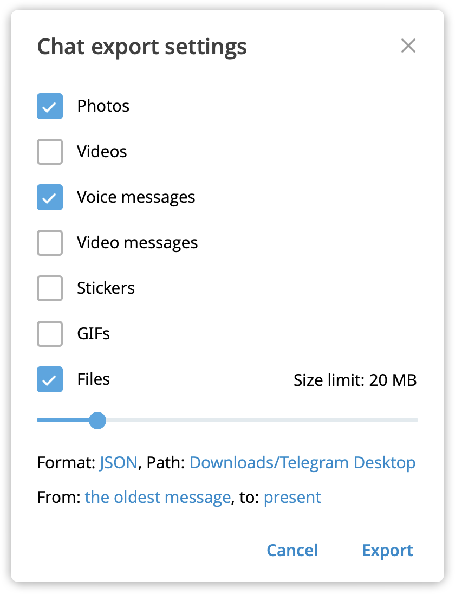
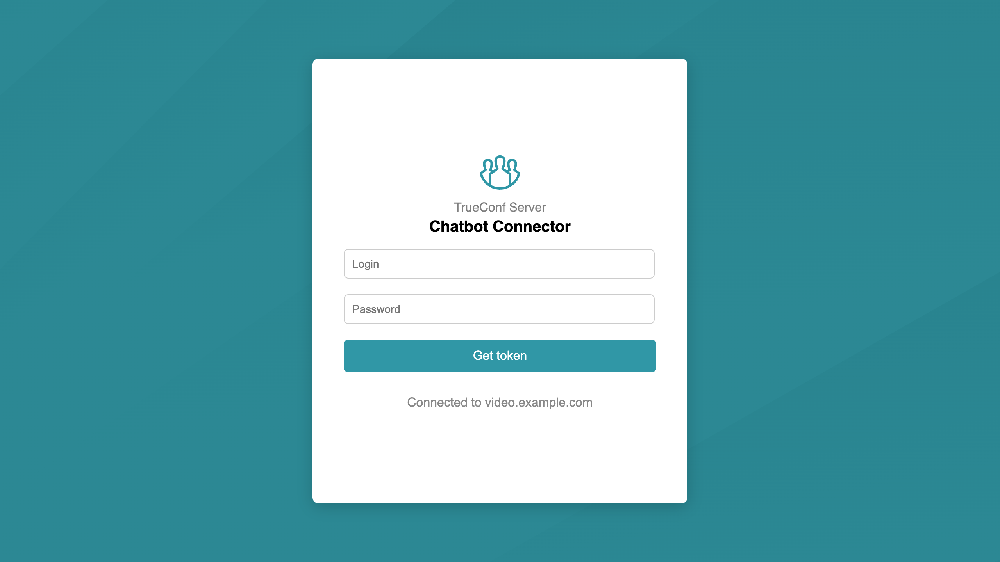
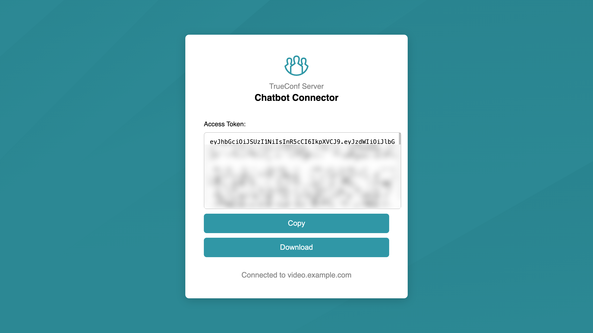

<p align="center">
  <a href="https://trueconf.com" target="_blank" rel="noopener noreferrer">
    <picture>
      <source media="(prefers-color-scheme: dark)" srcset="assets/logo-cyrillic.svg" type="image/svg">
      
    </picture>
  </a>
</p>

<h1 align="center">🛡️ Secure Chat Migration from Telegram to TrueConf</h1>

<p align="center">Need a secure messenger without restrictions?
Easily migrate all your chats from Telegram to TrueConf in just a few clicks.
Migration is supported only in the on-premise versions of <a href="https://trueconf.com/products/server/video-conferencing-server.html">TrueConf Server</a> / <a href="https://trueconf.com/products/enterprise/trueconf-enterprise.html">TrueConf Enterprise</a>.</p>

<p align="center">
     <a href="https://pypi.org/project/python-trueconf-bot" target="_blank">
      
</a>
    <a href="https://t.me/trueconf_chat" target="_blank">
        
    </a>
    <a href="https://chat.whatsapp.com/GY97WBzSgvD1cJG0dWEiGP">
        
    </a>
</p>

<p align="center">
  
</p>

<p align="center">
  <a href="./README.md">English</a> /
  <a href="./README-ru.md">Русский</a>
</p>

## Introduction

To migrate your chats from Telegram to TrueConf you need to:

1. [Export the Telegram chat](#export-telegram-chat).
2. [Configure the configuration file](#configuration-file-setup).
3. If needed, [create user accounts](#automatic-user-registration-in-trueconf-server) in advance on the video conferencing server.
4. [Run the migration script](#chat-migration).

You will also need:

* [Telegram Desktop](https://desktop.telegram.org/) installed;
* a deployed [TrueConf Server](https://trueconf.com/products/tcsf/trueconf-server-free.html) version 5.5 or higher ([documentation](https://trueconf.com/docs/server/en/admin/server-part/));
* Python 3.11 or higher installed;
* a little patience.

## Downloading the Repository and Setting up the Environment

On the repository main page, click **Code** → **Download ZIP**. Then unpack the archive into any directory.

### Python

To run the prepared scripts, you must have Python 3.11 or higher installed. For Windows, download it from the [official website](https://www.python.org/). On Linux and macOS, Python is usually pre-installed. Check your version with:

```bash
> python --version
Python 3.12.4
```

> [!IMPORTANT]
> Update your version if necessary, otherwise the script will not work.

### Environment Setup

We use **pipenv** for dependency installation and environment setup. Install it with:

```bash
pip install pipenv
```

Then, navigate to the directory where you unpacked the archive:

```bash
cd path/to/folder
```

and run:

```bash
pipenv install
```

## Export Telegram Chat

After installing and logging into Telegram Desktop, all your chats will be available.

> [!TIP]
> If you are an organization admin and don’t have access to the target chats, ask any chat member to export the history instead.

To export history:

1. Open the chat and click the three-dot button in the header.

<p align="center"></p>

2. Select **Export chat history**.

3. In the export settings window:

   * select the media you want;
   * set file size limits;
   * choose **JSON** as the format;
   * select the save path or leave default `Downloads/Telegram Desktop/`;
   * configure the date range.

<p align="center"></p>

4. Click **Export**.

Wait until the chat is fully exported before closing the window.

> [!CAUTION]
> Do not cancel the process until it finishes, otherwise the file may be corrupted.

## Configuration File Setup

### Description

> [!NOTE]
> The configuration file is written in [TOML](https://toml.io/).

Open `config.toml`. You will see the following structure:

```toml
telegram_export_dir = ""

[server]
address = "" # IP or domain.name
verify_ssl = false # or true if needed
access_token = "" # If you don't use access_token enter `client_id` and `client_secret`
client_id = ""
client_secret = ""


[chat]
name = ""
type = "" # available: personal, group, channel
owner = "" # who created chat

[chat.datetime]
view_original_time_in_message = false # or true if needed
timezone = "GMT" # need if view_original_time_in_message = true
caption = "" # example: f"{caption}{dt}"


[chat.voice_message]
convert_voice_message_to_video = false
cover_image = "cover/en.png" # by default "cover/en.png"

[registration]
auto = false # or true if needed
email_domain = "" # If it does not exist, the external server name will be substituted.
default_password = ""

[users]

[users.trueconf_id]
display_name = ""
password = ""
access_token = ""
telegram_id = ""
type = ""
```

For a successful migration, you need to fill in the configuration file according to the following description:

| Section             | Parameter                      | Description                                                                                                                                                                                                                           |
|---------------------|--------------------------------|---------------------------------------------------------------------------------------------------------------------------------------------------------------------------------------------------------------------------------------|
|                     | telegram_export_dir            | Path to the folder containing the exported Telegram chat                                                                                                                                                                              |
| server              |                                | TrueConf Server settings                                                                                                                                                                                                              |
|                     | address                        | Domain name or IP address of the TrueConf Server                                                                                                                                                                                      |
|                     | verify_ssl                     | SSL certificate verification. Set to `true` if you have a trusted certificate.                                                                                                                                                        |
|                     | access_token                   | Authorization token (*TTL = 1 hour*). Required if you want to automate adding a large number of users to TrueConf Server via API.                                                                                                     |
|                     | client_id, client_secret       | ID and secret of the created OAuth application. Required if you have not worked with the TrueConf Server API (see details below).                                                                                                     |
| chat                |                                | New chat settings in TrueConf Server                                                                                                                                                                                                  |
|                     | name                           | Chat name                                                                                                                                                                                                                             |
|                     | type                           | Chat type: `personal` (one-to-one), `group` (group chat), `channel` (channel).                                                                                                                                                        |
|                     | owner                          | Creator (for `personal`) or chat owner (for `group` and `channel`)                                                                                                                                                                    |
| chat.datetime       |                                | Settings for displaying the original date and time of the Telegram message.                                                                                                                                                           |
|                     | view_original_time_in_message  | If `true`, each text message will include the original date and time of sending.                                                                                                                                                      |
|                     | timezone                       | Time zone setting. Specify the correct time zone for most users in the chat. Default: `GMT` (UTC).                                                                                                                                    |
|                     | caption                        | Optionally add a prefix before the date and time, e.g., `Sent:` or `Date:`.                                                                                                                                                           |
| chat.voice\_message |                                | Voice message migration settings                                                                                                                                                                                                               |
|                     | convert_voice_message_to_video | If `true`, all voice messages will be converted to `mp4` video format. Requires [ffmpeg](https://ffmpeg.org/).                                                                                                                        |
|                     | cover_image                    | If `convert_voice_message_to_video = true`, the specified placeholder image will be used.                                                                                                                                             |
|                     | data_time                      | If `true`, the **text message** will include the date and time of the original Telegram message.                                                                                                                                      |
| registration        |                                | Settings for automatic user registration on TrueConf Server.                                                                                                                                                                          |
|                     | auto                           | If `true`, when using `parse_users.py`, the `display_name` and `password` parameters will be automatically added.                                                                                                                     |
|                     | email_domain                   | If using corporate email, specify the domain to be used in the `email` field during automatic user creation. For example, if your domain is `mail.example.com`, then user `user` will have the email address `user@mail.example.com`. |
|                     | default_password               | Common password for all accounts. The `password` parameter will be auto-filled when using `parse_users.py`.                                                                                                                           |
| users               |                                | Section for configuring user accounts (chat participants). Can be populated automatically using `parse_users.py`.                                                                                                                     |
|                     | display_name, password         | Auto-filled if `registration.auto = true`. Required for automatic user addition with `add_users_to_server.py`.                                                                                                                        |
|                     | telegram_id, type              | Numeric Telegram ID and user type (`user`,`channel`). Automatically filled by `parse_users.py`.                                                                                                                                       |
|                     | access_token                   | User authorization token in TrueConf Chatbot Connector (*TTL = 1 month*). Required for chat migration. If not specified, `password` will be used instead.                                                                             |

> [!TIP] So many parameters to fill out 🤯?
> Actually – no. To simplify this process, we have prepared scripts, as described below.

### Automatic User Collection

If a Telegram chat has a large number of participants, filling out the config file can be frustrating \:cry:. Therefore, the TrueConf team prepared the script [parse\_users.py](parse_users.py) to automatically populate the `[users]` section.

> [!NOTE] What does the script do?
> It analyzes the `result.json` file (from the export) and generates a list of users.

1. In `config.toml`, specify the path to the folder with the exported chat:

   ```toml
   telegram_export_dir = "~/Downloads/Telegram Desktop/ChatExport_2025-09-05"
   ```

2. Run the script in the configured environment:

   ```shell
   pipenv run python parse_users.py
   ```

3. If successful, you will see a confirmation that the configuration file was updated:

   ```shell
   File 'config.toml' updated successfully
   ```

4. In `config.toml`, under `[users]`, all participants will be collected with the following parameters:

   ```toml
   [users]

   [users.ivanov_ivan]

   access_token = ""
   telegram_id = "12345678"
   type = "user"
   ```

If you plan to run automatic user registration on TrueConf Server, specify the following parameters in `config.toml`:

```toml
[registration]
auto = true # Required
email_domain = "mail.example.com" # Optional (see description)
default_password = "12345678" # Optional (see description)
```

and restart the script.


### Automatic User Registration in TrueConf Server

To migrate chats from Telegram to TrueConf, all users participating in the conversation must be registered on the TrueConf Server.
If you **do not use LDAP**, you can use the script [add_users_to_server.py](add_users_to_server.py) for automatic registration.

> [!IMPORTANT]
> If you already have an established infrastructure, skip to the next section.

Before running the script, make sure all the data in the `[users]` block meets your expectations. If necessary, adjust the TrueConf ID (before the @), display name (`display_name`), and password (`password`):

```toml
[users.<trueconf_id>]

# Example:
[users.joe_brown]
display_name = "Joe Brown"
password = "verystrongpassword1357"
```

> [!WARNING]
> Double-check all new users because automatic re-registration is not available. If you make a mistake, you’ll need to fix it through the server’s admin panel.

After verifying the data, run the script:

```shell
pipenv run python add_users_to_server.py
```

For each user, you will receive a response like:

```
Successful addition:
✅ User has been added to the server

User already exists:
⚠️ User already exists on the server

Error:
🔴 Error for user
```

### Editing the `[users]` Section for Existing Infrastructure

> \[!IMPORTANT]
> This section should be reviewed by administrators **only** if users are already registered in TrueConf Server. Before performing these steps, complete the Automatic User Collection section.

To ensure a successful migration, you need to match Telegram users with TrueConf Server users. For each user, configure the `[users]` block as follows:

1. Specify the partial TrueConf ID (before the @):

   ```toml
   [users.<trueconf_id>]

   # Example:
   [users.joe] -> [users.joe_brown]
   ```

2. Provide the `access_token`:

   ```toml
   [users.joe_brown]
   access_token = "eyJhbGciOiJSUzI1NiIsInR5cCI6IkpXVCJ9..."
   ```

See the next section for instructions on how to obtain the authorization token.

### Obtaining `access_token` for Chat API Authorization

To get an `access_token`, you need to send a POST request with the TrueConf account login and password (see [documentation](https://trueconf.com/docs/chatbot-connector/en/connect-and-auth/#access-token)).
The problem is that the TrueConf Server administrator does not know user account passwords.
Asking users to share their domain account password is like asking for the “keys to the house where the money is kept.”

That’s why the TrueConf team prepared an [HTML page](chatbot/en/index.html) to simplify this process. What to do with it? Just add it to your TrueConf Server or the required TrueConf Enterprise node.

#### Adding the Page to the TrueConf Web Server

1. Copy the [`chatbot`](chatbot) folder to the following path:

   **Windows (PowerShell):**

   ```shell
   Copy-Item -Path "D:\chatbot" -Destination "C:\Program Files\TrueConf Server\httpconf\site" -Recurse
   ```

   **Linux:**

   ```shell
   sudo cp ~/chatbot /opt/trueconf/server/srv/site/
   ```

2. Restart the **TrueConf Web Manager** service:

   **Windows (PowerShell):**

   ```shell
   Restart-Service -Name "TrueConf Web Manager"
   ```

   **Linux:**

   ```shell
   sudo systemctl restart trueconf-web
   ```

> [!CAUTION]
> When updating TrueConf Server, the `chatbot` directory will be removed from the server.

#### Token Retrieval Instructions

Ask each user you are adding to the chat to obtain an access\_token as follows:

1. In a browser, go to `https://server.address/chatbot/en/index.html`.
   Enter your login (TrueConf ID) and password in the input fields and click **Get Token**:

   <p align="center">
     
   </p>

2. If successful, the token will be displayed. Copy it or download it as a file for further transfer to your administrator:

   <p align="center">
     
   </p>

## Chat Migration

You’ve made it to this step! For a successful migration, specify the chat name, type, and owner in the config file:

```toml
[chat]

# Example
name = "Secret Chat"
type = "group" # available: personal, group, channel
owner = "sherlock" # who created chat
```

### Date and Time Synchronization

By default, TrueConf Server does not allow sending messages retroactively.
If you want to preserve the original date and time of messages, adjust the following settings:

* set `view_original_time_in_message` to `true`;
* configure the time zone, e.g., `Europe/London`;
* optionally, add a `caption` before the date and time. Make sure to leave a **space** at the end of the string.

```toml
[chat.datetime]

view_original_time_in_message = true
timezone = "Europe/London"
caption = "Sent: "
```

In this case, each text message will include a note like: `Sent: 01.09.2025 14:10:00 +0300`.

### Converting Voice Messages from .ogg to .mp4

Voice messages in Telegram are stored in **ogg** format, which the TrueConf client app does not support.
For convenience, you can convert all voice messages to video with a cover image (`cover_image`).
The migration script will do this automatically using **ffmpeg** (must be pre-installed and added to `path`).

To enable this:

1. In the config file, set `convert_voice_message_to_video = true`.
2. You may also set a custom cover, e.g., `cover_image = "path/to/cover_image.png"`.

Example:

```toml
[chat.voice_message]
convert_voice_message_to_video = true
cover_image = "path/to/cover_image.png"
```

Additionally, the bottom-right corner will display the source and original recording time.

<p align="center">
  
</p>

### Running Migration

To start the migration, run the following command in the terminal:

```shell
pipenv run python build_chat.py
```

For `group` and `channel` chats, each run of the script will create a new chat instance.

> [!TIP]
> If you, as an administrator, want strict control over the migration process, specify your TrueConf ID as the `owner`.
> Later, you can transfer chat ownership to another user using the TrueConf client application.

If the migration is successful, you will see a copy of the Telegram chat:


