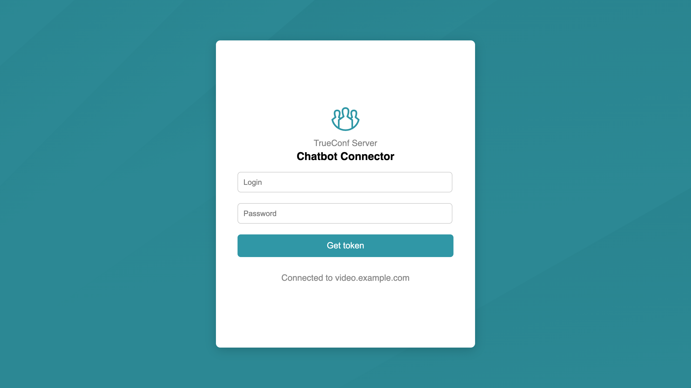

<p align="center">
  <a href="https://trueconf.com" target="_blank" rel="noopener noreferrer">
    <picture>
      <source media="(prefers-color-scheme: dark)" srcset="https://raw.githubusercontent.com/TrueConf/.github/refs/heads/main/logos/logo-dark.svg">
      
    </picture>
  </a>
</p>

<h1 align="center">🛡️ Secure сhat transfer from Telegram to TrueConf</h1>

<p align="center">Looking for a secure messenger? Transfer all your chats from Telegram to TrueConf in just a few clicks. Migration is supported only in the on-premise solutions <a href=\"https://trueconf.ru/products/server/server-videokonferenciy.html\">TrueConf Server</a> / <a href=\"https://trueconf.ru/products/enterprise/trueconf-enterprise.html\">TrueConf Enterprise</a>.</p>
<p align="center">
     <a href="https://pypi.org/project/python-trueconf-bot" target="_blank">
      
</a>
    <a href="https://t.me/trueconf_chat" target="_blank">
        
    </a>
    <a href="https://discord.gg/2gJ4VUqATZ">
        
    </a>
</p>
<p align="center">
  
</p>

<p align="center">
  <a href="./README.md">English</a> /
  <a href="./README-ru.md">Русский</a>
</p>

## Getting started

To migrate chats from Telegram to TrueConf, you need to:

1. [Export a chat from Telegram](#telegram-chat-export).
1. [Set the parameters in the configuration
file](#configuration-file-settings).
1. [If necessary,
create](#automatic-collection-of-user-information) user
accounts on the video conferencing server in advance.
1. [Run the script](#chat-migration).

You will also need:

- Installed [Telegram Desktop](https://desktop.telegram.org/) application
- Deployed [TrueConf
Server](https://trueconf.com/products/tcsf/free-video-conferencing-server.html)
version 5.5 or higher
([guide](https://trueconf.com/docs/server/en/admin/server-part/))
- Python 3.11 or higher
- A little bit of patience.

## Downloading the repository and setting up the environment

To download files/scripts from the main page of the repository, click the
**Code** button and select **Download ZIP**. Next, unpack the archive to the
selected directory.

### Python

To work with these scripts, you need to have Python 3.11 or higher. If you are
using Windows, you can download Python from the [official
website](https://www.python.org/). On Linux and macOS, Python is usually
pre-installed. Check your version with this command:

```bash
> python --version
Python 3.12.4
```

> [!IMPORTANT]
> If necessary, update your version; otherwise, the script will not work.

### Setting up the environment

To install dependencies and set up the environment, we use **pipenv**. It is not
available on the system by default and needs to be installed:

```bash
pip install pipenv
```

Next, in the terminal, go to the directory with the unpacked archive:

```bash
cd path/to/folder
```

and run the command to set up the environment:

```bash
pipenv install
```

## Telegram chat export

After installing and signing in to Telegram Desktop, you will be able to access
all your chats.

> [!TIP]
> If you are an organization administrator and do not have access to certain conversations, you can ask any chat participant to export the history instead of you.

To export the history:

1. Go to the chat and click the button with three dots in the header:

<p align="center"></p>

1. Select **Export chat history** in the menu.
1. In the export settings window:

   - Check the boxes for the types of media you need to export
   - Set a size limit for files
   - Choose the **JSON** format
   - Set the path for saving the file or use the default path
`Downloads/Telegram Desktop/`
   - Set the range, for example, from the first message to the current date, from
01.02.2022 12:00 to 03.03.2023 19:00, etc.

<p align="center"></p>

1. Click the **Export** button.

The application will start saving the chat with selected settings. You can close
this window, if it obstructs the view.

> [!CAUTION] 
> Wait for the operation to complete fully. If you have selected a date range and see that the messages have already been exported, do not cancel the process to avoid file corruption.

## Configuration file settings

### Description

> [!NOTE] We use the [TOML](https://toml.io/) language to configure settings.

Open the `config.toml` file. You will see the following structure:

```toml
telegram_export_dir = ""

[server]
address = "" # IP or domain.name
verify_ssl = false # or true if verification is needed
access_token = "" # If you don't use access_token, enter the values for `client_id` and `client_secret`
client_id = ""
client_secret = ""


[chat]
name = ""
type = "" # available types: personal, group, channel
owner = "" # who created the chat

[chat.datetime]
view_original_time_in_message = false # or true if needed
timezone = "GMT" # need if view_original_time_in_message = true
caption = "" # example: f"{caption}{dt}"


[chat.voice_message]
convert_voice_message_to_video = false
cover_image = "cover/en.png" # by default "cover/en.png"

[registration]
auto = false # or true if needed
email_domain = "" # If it does not exist, the external server name will be used instead.
default_password = ""

[users]

[users.trueconf_id]
display_name = ""
password = ""
access_token = ""
telegram_id = ""
type = ""
```

To transfer chats successfully, you need to fill out the configuration file
according to the following description:

| Section | Parameter | Description |
| --- | --- | --- |
|  | telegram_export_dir | Path to the folder with the exported Telegram chat |
| server |  | TrueConf Server settings |
|  | address | Domain name or IP address of TrueConf Server |
|  | verify_ssl | SSL certificate verification. The value should be set to `true` if you have a trusted certificate. |
|  | access_token | Авторизационный токен (*TTL = 1 час*). Нужен, если вы хотите автоматизировать добавление большого кол-ва пользователей в TrueConf Server через API. |
|  | client_id, client_secret | ID and secret of the created OAuth application. Required if you have not worked with the TrueConf Server API (check for more details below) |
| chat |  | Settings for a new chat in TrueConf Server |
|  | name | Chat name |
|  | type | Chat type: `personal` (one-on-one chat), `group` (group chat), `channel` (channel). |
|  | owner | The creator (for a `personal` chat) and the chat owner (for a `group` chat and `channel`) |
| chat.datetime |  | Settings for displaying the original date and time when a message was sent in Telegram. |
|  | view_original_time_in_message | If the value is set to `true`, each text message will include the date and time of sending. |
|  | timezone | Time zone settings. It is necessary to specify the correct time zone for most users in the chat. The default value is `GMT` (UTC). |
|  | caption | If necessary, you can add a label before the date and time, such as `Sent:` or `Date:`. |
| chat.voice_message |  | Settings for the transfer of voice messages |
|  | convert_voice_message_to_video | If the value is set to `true`, all voice messages will be converted to the `mp4` video format. The [ffmpeg](https://ffmpeg.org/) package has to be installed in advance. |
|  | cover_image | If `convert_voice_message_to_video = true`, the specified placeholder will be used. |
|  | date_time | If set to `true`, the **text message** will include the date and time when the original Telegram message was sent. |
| registration |  | Settings for automatically adding users on TrueConf Server. |
|  | auto | If the value is set to `true`, the `display_name` and `password` parameters will be added to [users] when `parse_users.py` is used. |
|  | email_domain | If a corporate email is used, you will need to specify the domain that will be used in the `email` field when a user is automatically added. For example, if you use the domain `mail.example.com`, the email of the added `user` will be `user@mail.example.com`. |
|  | default_password | The general password for all accounts. This value will be used for automatically filling out the `password` parameter when the `parse_users.py` script is used. |
| users |  | The section where user accounts of chat participants are configured. It can be populated automatically with `parse_users.py`. |
|  | display_name, password | Automatically filled if `registration.auto = true`. Required for automatically adding users with the help of `add_users_to_server.py` |
|  | telegram_id, type | Digital Telegram ID and user type (`user`, `channel`). These fields are automatically filled when `parse_users.py` is used. |
|  | access_token | Авторизационный токен пользователя в TrueConf Chatbot Connector (*TTL = 1 мес.*). Необходим, для переноса чатов. Если не указан, используется `password`. |

> [!TIP]
> **Do I really need to fill so many parameters 🤯?** Actually, no. To simplify this process, we provided scripts, described below.

### Automatic collection of user information

If the Telegram chat has a large number of participants, filling out the config
file can be quite discouraging :cry:. Due to this reason, the TrueConf team
created a script <parse_users.py> which automatically populates the `[users]`
section.

> [!NOTE] 
> **What does the script do?** It parses the exported `result.json` file and generates the list of users.

1. Specify the path to the folder with the exported chat In the `config.toml`
file:
   ```toml
   telegram_export_dir = "~/Downloads/Telegram Desktop/ChatExport_2025-09-05"
   ```
1. Run the script in the configured environment:
   ```shell
   pipenv run python parse_users.py
   ```
1. If the operation is completed successfully, you will receive a notification
about the correct update of the configuration file:
   ```shell
   The file 'config.toml' has been successfully updated
   ```
1. In the `[users]` section of the `config.toml` file, you will have all the
participants listed with the following parameters:
   ```toml
   [users]

[users.john_doe]

access_token = ""
telegram_id = "12345678"
type = "user"
   ```

If you will automatically add users to TrueConf Server, specify the following
parameters in the `config.toml` file:

```toml
[registration]
auto = true # Required
email_domain = "mail.example.com" # Optional (read the description)
default_password = "12345678" # Optional (read the description)
```

and restart the script.

### How to add users automatically to TrueConf Server

To migrate chats from Telegram to TrueConf, all users participating in the
conversation have to be registered on TrueConf Server. If you **do not use
LDAP**, you can run the script <add_users_to_server.py> to register users
automatically.

> [!IMPORTANT]
> If you have already deployed and configured the video conferencing
server, go to the next section.

Before running the script, make sure that all data in the `[users]` block meets
your expectations. If necessary, change the TrueConf ID (before @),
`display_name` and `password`:

```toml
[users.<trueconf_id>]

#Example:
[users.john_doe]
display_name = "John Doe"
password = "verystrongpassword1357"
```

> [!WARNING]
> Double-check all new users since automatic re-registration is unavailable. 
> If you make a mistake, you will need to correct it in the server control panel.

After verifying all the data, run the script:

```shell
pipenv run python add_users_to_server.py
```

For each user, you will receive one of the following responses:

```
✅ A user has been added to the server

⚠️ The user already exists on the server

 🔴 Error for user
```

### Editing the `[users]` section for configured infrastructure

> [!IMPORTANT]
> This section should be studied by administrators **only** if users have already been created on TrueConf Server. 
> Go through the section "Automatic collection of user information" before taking these steps.

To successfully migrate a chat, you need to map Telegram users to TrueConf Server
users. For each user, configure the `[users]` block in the following way:

1. Enter the incomplete TrueConf ID (up to @):
   ```toml
   [users.<trueconf_id>]

# Example:
[users.john] -> [users.john_doe]
   ```
1. Specify the `access_token`:
   ```toml
   [users.john_doe]
access_token = "eyJhbGciOiJSUzI1NiIsInR5cCI6IkpXVCJ9…"
   ```

Refer to the next section to learn how to get an authentication token.

### How to get an `access_token` for authentication in the chat API

To get an `access_token`, you need to send a POST request with the TrueConf
account username and password (refer to the
[documentation](https://trueconf.ru/docs/chatbot-connector/ru/connect-and-auth/#access-token)).
The problem is that a TrueConf Server administrator does not know the passwords
of the server accounts. Asking users to share their domain account passwords is
inherently insecure.

Due to this reason, TrueConf team created an [HTML page](chatbot/ru/index.html)
to simplify this process. What should I do with it? Just add it to your TrueConf
Server or the required TrueConf Enterprise node.

#### How to add the page to the TrueConf web server

1. Copy the [`chatbot`](chatbot) folder to the following path:

   **Windows (PowerShell):**
   ```shell
   Copy-Item -Path "D:\chatbot" -Destination "C:\Program Files\TrueConf Server\httpconf\site" -Recurse
   ```

   **Linux:**
   ```shell
   sudo cp ~/chatbot /opt/trueconf/server/srv/site/
   ```
1. Restart the **TrueConf Web Manager** service:

   **Windows (PowerShell):**
   ```shell
   Restart-Service -Name "TrueConf Web Manager"
   ```

   **Linux:**
   ```shell
   sudo systemctl restart trueconf-web
   ```

> [!CAUTION]
> When TrueConf Server is updated, the `chatbot` directory will be deleted from the server.

#### How to get the token

Ask each user, who will be added to the chat, to get the access_token in the
following way:

1. Open the page `https://server.address/chatbot/ru/index.html` in your browser.
Enter your login (TrueConf ID) and password in the input fields, then click
**Get token**:
<p align="center">
  
</p>


1. In case of success a token will be displayed. Copy it or download as a file
that can be later sent to the administrator:
<p align="center">
  
</p>


## Chat migration

You've finally made it to this step! To transfer a chat, specify its name, type,
and owner in the configuration:

```toml
[chat]

#Example
name = "Secret chat"
type = "group" # available types are as follows: personal, group, channel
owner = "sherlock" # who created chat
```

### Date and time synchronization

By default, TrueConf Server does not allow a message to be sent with a past date.
If it is important for you to check the date and time of the original message,
adjust the following settings:

- Set `view_original_time_in_message` to `true`
- Set the time zone, for example, `Europe/Moscow`
- If necessary, specify a caption for the date and time. Make sure to leave a
**space** at the end of the line.

```toml
[chat.datetime]

veiw_original_time_in_message = true
timezone = "Europe/Moscow"
caption = "Sent: "
```

In this case each text message will have this caption at the bottom
`Sent: 01.09.2025 14:10:00 +0300`.

### Conversion of voice messages from .ogg to .mp4

Voice messages in Telegram are in the **ogg** format. TrueConf client
applications do not support this format. For the sake of convenience, you can
convert all audio messages to video with a `cover_image`. 

> [!IMPORTANT]
> To render timestamps on video, FFmpeg must be installed with `drawtext` filter support. Before enabling this feature, please check your environment:
> 
> ```bash
> pipenv run python check_ffmpeg.py
> ```
> 
> If the check passes successfully (FFmpeg OK ✅), you can proceed with the configuration.

To do it:

1. In the config file, enter `convert_voice_message_to_video = true`.
1. Choose the cover localization: `cover/ru.png` (in Russian) or `cover/en.png`
(in English). If necessary, you can change the cover to your own by writing
`cover_image = "path/to/cover_image.png"`.

Example:

```toml
[chat.voice_message]  
convert_voice_message_to_video = true  
cover_image = "path/to/cover_image.png"
```

Additionally, in the bottom right corner you will see additional information: the
export source and the time when the original recording was made.

<p align="center">
  
</p>

### Migration start

To start migration, run the command in the terminal:

```shell
pipenv run python build_chat.py
```

If the chat type is either `group` or `channel`, a new chat copy will be created
each time the script is executed.

> [!TIP]
> If you, as an administrator, want to take full control over the migration process, specify your TrueConf ID in the `owner` parameter.

Later, you can always transfer chat rights to another user in TrueConf client
application.

If migration is completed successfully, a copy of the Telegram chat will be
created:

🎬 [Watch the video on YouTube](https://youtu.be/D52e83ABdz0)
