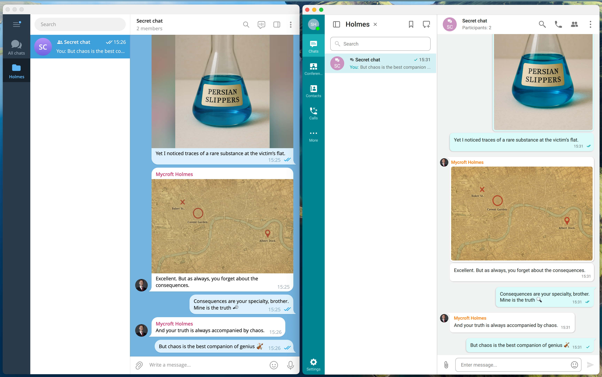
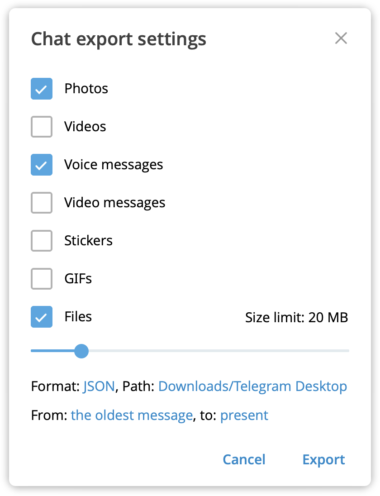
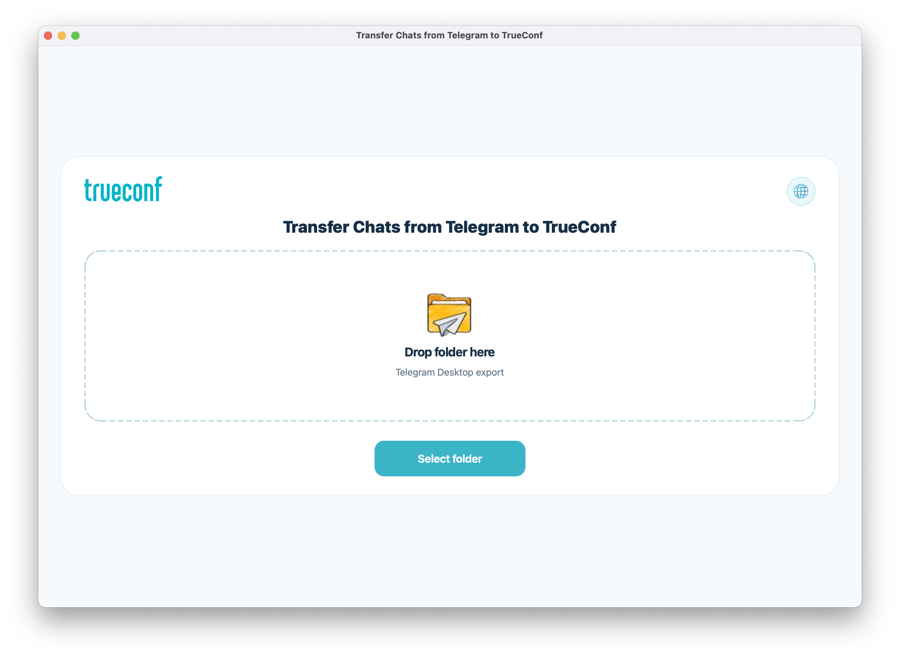
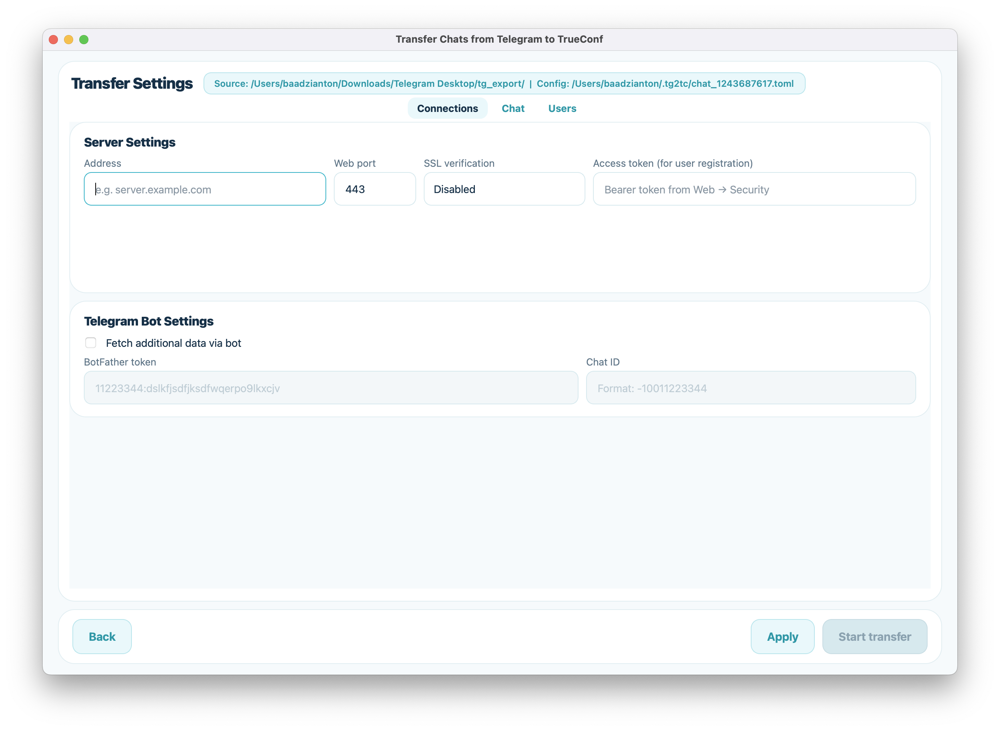
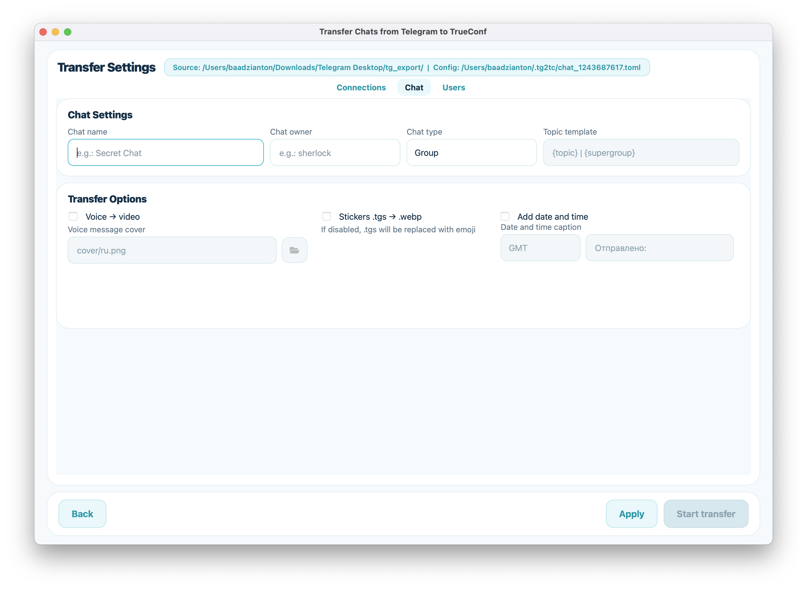
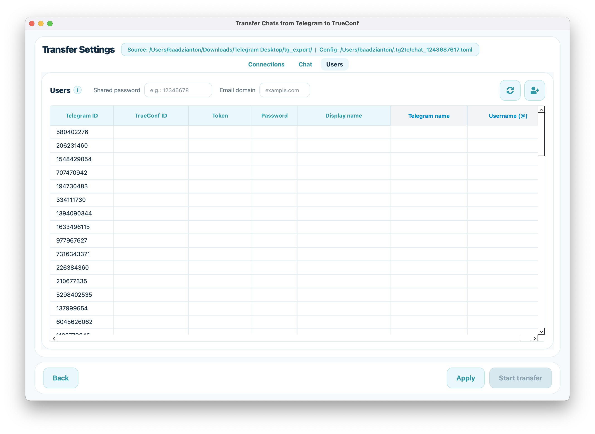
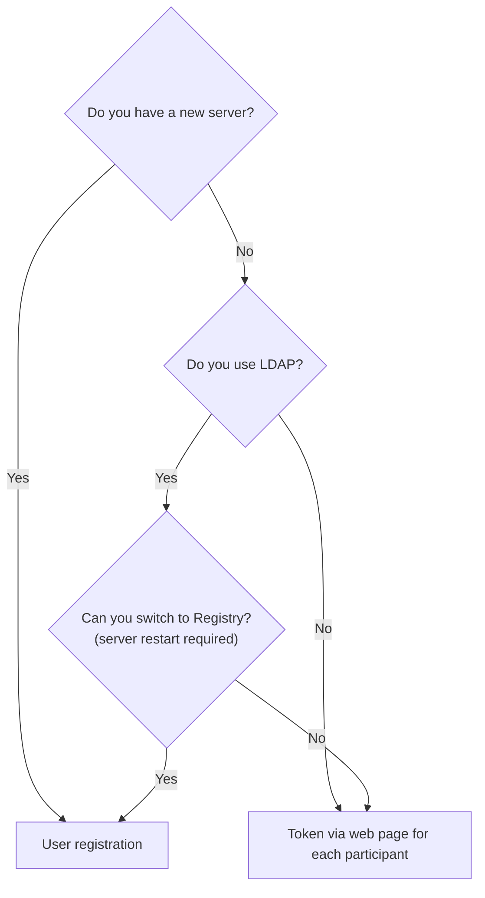
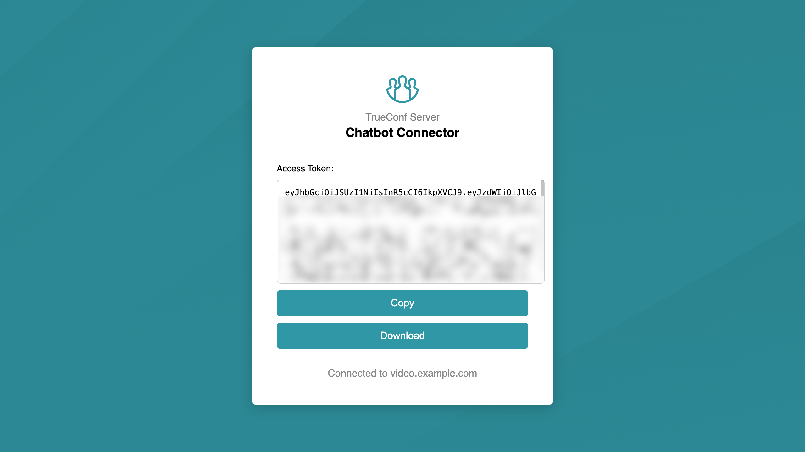

<p align="center">
  <a href="https://trueconf.com" target="_blank" rel="noopener noreferrer">
    <picture>
      <source media="(prefers-color-scheme: dark)" srcset="https://raw.githubusercontent.com/TrueConf/.github/refs/heads/main/logos/logo-dark.svg">
      
    </picture>
  </a>
</p>

<h1 align="center">🛡️ Secure chat transfer from Telegram to TrueConf</h1>

<p align="center">Looking for a secure messenger without service restrictions?
Transfer your Telegram chats to TrueConf in just a few clicks.
Migration is supported only for on-premises deployments of <a href="https://trueconf.com/products/server/video-conferencing-server.html">TrueConf Server</a> / <a href="https://trueconf.com/products/enterprise/trueconf-enterprise.html">TrueConf Enterprise</a>.</p>

<p align="center">
     <a href="https://pypi.org/project/python-trueconf-bot" target="_blank">
      
</a>
    <a href="https://t.me/trueconf_chat" target="_blank">
        
    </a>
    <a href="https://discord.gg/2gJ4VUqATZ">
        
    </a>
</p>

<p align="center">
  
</p>

<p align="center">
  <a href="./README.md">English</a> /
  <a href="./README-ru.md">Русский</a>
</p>

> [!CAUTION]
> These instructions apply to TrueConf Server version 5.5.3 or later.  
> If you are using an earlier version, [update the server](https://trueconf.com/products/server/howto-update-trueconf-server.html) first.

## 🚀 Quick start

Migration consists of six steps. The full flow is shown below without extra details so that you can understand where you are in the process and how much remains to be done.

1. **Prepare the environment** — Telegram Desktop, TrueConf Server, Python 3.11+. → [Introduction](#introduction)
2. **Export the chat** from Telegram in JSON format. → [Telegram chat export](#telegram-chat-export)
3. **Download and start** the migration tool. → [Installation and first launch](#installation-and-first-launch)
4. **Configure the connection** to TrueConf Server and, optionally, a Telegram bot for automatic participant detection. → [Connections tab](#connections-tab)
5. **Match chat participants with their TrueConf IDs.** If users do not exist on the server yet, register them. The procedure depends on whether you use LDAP. → [Users tab](#users-tab)
6. **Start the migration** and get a copy of the chat in TrueConf. → [Chat migration](#chat-migration)

> [!TIP]
> If any term below is unclear, check the [Terms](#-terms) section before searching for it elsewhere.

### 📖 Terms

| Term | Meaning |
|---|---|
| **TrueConf ID** | A user login in TrueConf Server, similar to a username. |
| **LDAP** | A mode where users and passwords are stored outside TrueConf Server in a corporate directory such as Active Directory. If you have never configured LDAP, you are probably not using it. |
| **Registry** | A mode where users and passwords are stored directly on TrueConf Server, without an external directory. |
| **access_token** | An API access key. The migration tool needs it to register users on your behalf. |
| **OAuth application** | A way to issue a temporary access token with limited permissions to the migration tool. This is safer than using a permanent administrator token. |

---

## Introduction

To migrate chats successfully, first:

1. Install [Telegram Desktop](https://desktop.telegram.org/).
2. Deploy [TrueConf Server](https://trueconf.com/products/tcsf/free-video-conferencing-server.html) version 5.5.3 or later:
   - [for Windows](https://trueconf.com/blog/knowledge-base/how-to-deploy-video-conferencing-server) ([video guide](https://www.youtube.com/watch?v=Tb3UTk1JSgg));
   - for Linux: [Debian](https://trueconf.com/blog/knowledge-base/how-to-install-video-conferencing-server-on-linux), [CentOS](https://trueconf.com/blog/knowledge-base/how-to-install-trueconf-server-on-centos-stream-9-linux-in-15-minutes), [Astra Linux](https://trueconf.com/blog/knowledge-base/how-to-install-trueconf-server-on-astra-linux-se-in-15-minutes), [ALT Server](https://trueconf.com/blog/knowledge-base/how-to-install-trueconf-server-on-alt-server-linux-in-15-minutes), [RED OS](https://trueconf.com/blog/knowledge-base/how-to-install-trueconf-server-on-red-os-linux-in-15-minutes).
3. Install [Python 3.11](https://docs.python.org/3/using/index.html) or later on any PC that is **not** the TrueConf Server machine.

> [!TIP]
> This open-source solution migrates chats without preserving the original message date and time as the actual send time. If this is critical for you, contact [technical support](https://trueconf.com/support.html) for assistance.

## Telegram chat export

After installing and signing in to Telegram Desktop, you will be able to access all your chats.

> [!TIP]
> If you are an organization administrator and do not have access to the target conversations, you can ask any chat participant to export the history instead of you.

To export the history:

1. Open the chat and click the button with three dots in the chat header:

   <p align="center"></p>

2. Select **Export chat history** in the menu.

3. In the export settings window:
   - select the media types you need;
   - set a size limit for files;
   - choose **JSON** as the format;
   - specify the save path or keep the default `Downloads/Telegram Desktop/` directory;
   - configure the date range, for example from the first message to the current date, or from 01.02.2022 12:00 to 03.03.2023 19:00, etc.

   <p align="center"></p>

4. Click **Export**.

The chat will start being saved with the selected settings. You can close this window if it gets in your way.

> [!CAUTION]
> Wait until the operation is fully completed. If you selected a date range and can already see that the messages have been exported, do not cancel the process to avoid file corruption.

## Installation and first launch

1. On the repository main page, click **Code** → **Download ZIP**.
2. Unpack the archive to any directory on your PC.

### Python

Python 3.11 or later is required to run the scripts.

- **Windows** — download it from the [official website](https://www.python.org/).
- **Linux and macOS** — Python is usually preinstalled.

Check your version with this command:

```bash
> python --version
Python 3.12.4
```

> [!IMPORTANT]
> If the version is lower than 3.11, update Python; otherwise, the script will not start.

### Environment setup

Create a virtual environment and install the dependencies, preferably using [uv](https://docs.astral.sh/uv/):

```bash
uv sync
```

### Starting the application

Run the software from the terminal:

```bash
uv run main.py
```

A window will open:

<p align="center">
   
</p>

Select or drag and drop the export folder into the highlighted area.

## Migration setup

### Connections tab

<p align="center">
   
</p>

1. **TrueConf Server settings:**

   - server address: domain name or IP address;
   - web port used for the HTTPS connection, `443` by default;
   - SSL certificate verification: **enabled** for trusted certificates and **disabled** for self-signed certificates;
   - access token from **Web → Security**. It is required only for user registration when you have a new installation without user accounts.

1. **Telegram bot settings** *(optional, but recommended for chats with many participants)*.

   These settings are used to automatically obtain the **@username** and **real name** of each Telegram chat participant, which simplifies matching them with existing TrueConf IDs.

   1. Create a bot via [BotFather](https://t.me/BotFather) and enter its token in the **BotFather token** field.
   2. Add the bot to the chat and grant it administrator permissions.
   3. Use [@userinfobot](https://t.me/userinfobot) to find the chat ID and enter it in the corresponding field.

> [!TIP]
> The **Apply** button saves the settings, so you can prepare for chat migration over an extended period of time.

### Chat tab

On the **Chat** tab, specify the following settings:

<p align="center">
   
</p>

#### Chat parameters

Specify:

- the name of the new chat;
- the chat owner, preferably a TrueConf ID. This user must be listed in the table on the **Users** tab;
- the chat type. For a group with topics, or a forum-style structure, select **Supergroup** and specify the **Topic template**.

> [!CAUTION]
> Do not change the values of the `{topic}` or `{supergroup}` placeholders.
> You can define your own format, for example by swapping them as `{supergroup} | {topic}` or by removing `{supergroup}`.
> By default, the subgroup name will look like this: `Topic name | Chat name`.

#### Migration options

#### Voice message conversion

TrueConf does not support the **ogg** format used by Telegram. Voice messages can be automatically converted to **mp4** video with a cover image, which can be replaced with your own. This allows users to play them through the built-in TrueConf viewer. The export source and the original recording time will be added in the bottom-right corner of the cover image.

<p align="center">

</p>

> [!IMPORTANT]
> 🧩 FFmpeg must be installed and added to PATH, with `drawtext` filter support.
> Before enabling this feature, check whether your system is ready:
>
> ```bash
> uv run check_ffmpeg.py
> ```
>
> If the check passes successfully (`FFmpeg OK ✅`), you can enable conversion in the settings.

#### Animated sticker conversion

Animated Telegram stickers are stored in **.tgs** format, which is a [Lottie](https://lottie.github.io/) animation archive. They can be converted to **webp**, a format supported by TrueConf. If conversion is disabled, such messages will be sent as regular emoji.

> [!IMPORTANT]
> 🧩 *Relevant only if you want to enable sticker conversion.* Conversion requires system libraries. If you do not need this feature, you can skip this step.

<details>
<summary><b>Installation on Windows (Cairo library required)</b></summary>

Install [MSYS2](https://www.msys2.org/), then:

1. Update the packages:

   ```bash
   pacman -Syu
   ```

2. If the console eventually shows a message similar to `warn: terminate MSYS2 without returning to shell and check for updates again`, restart the terminal and run the command again.

3. Install the library:

   ```bash
   pacman -S mingw-w64-x86_64-cairo
   ```

</details>

### Message date and time

This version of the program does not send messages with their original Telegram timestamp. All messages are sent with the time when the script is running. If the original time is critical for you, there are two options:

- enable the checkbox, configure the time zone and caption — then a text caption such as `Sent: 01.09.2025 14:10:00 +0300` will be added to each message;
- contact [TrueConf technical support](https://trueconf.com/support.html) for assistance.

### Users tab

<p align="center">
   
</p>

For each Telegram ID, specify the correct TrueConf ID, or login. The **Password** and **Display name** columns are needed only when registering new users on the server. The **@username** and **Real name** columns are filled in automatically when using [Telegram bot integration](#connections-tab) by clicking .

> [!WARNING]
> Automatic completion requires access to Telegram servers. If you see an error, check whether your network access tools are enabled.

If users do not exist on TrueConf Server yet, they need to be registered. The registration method depends on your situation:


```mermaid
flowchart TD
    A{Do you have a new server?} -->|Yes| B[User registration]
    A -->|No| C{Do you use LDAP?}
    C -->|No| E[Token via web page for each participant]
    C -->|Yes| D{"Can you switch to Registry?<br/>(server restart required)"}
    D -->|Yes| B
    D -->|No| E
```

- **New server with no users yet** → [User registration in TrueConf Server](#user-registration-in-trueconf-server).
- **The server has already been used and LDAP is not used** → you do not know users' passwords, so registration will not help. Go directly to [Obtaining a token for chat API authorization](#obtaining-a-token-for-chat-api-authorization).
- **LDAP is used and you can restart the server and temporarily switch to Registry** → [Configured infrastructure when using LDAP](#configured-infrastructure-when-using-ldap).
- **LDAP is used and switching to Registry is not possible** → [Obtaining a token for chat API authorization](#obtaining-a-token-for-chat-api-authorization).

#### User registration in TrueConf Server

> [!NOTE]
> This section applies to two cases: (1) you have a new server with no users yet, or (2) you use LDAP and have already switched the server to Registry as described in [Configured infrastructure](#configured-infrastructure-when-using-ldap). If neither case applies to you, use [Obtaining a token for chat API authorization](#obtaining-a-token-for-chat-api-authorization).

To migrate chats from Telegram to TrueConf, every chat participant must be registered in TrueConf Server. Registration is performed directly on the **Users** tab:

1. Specify the TrueConf ID, display name, and email domain for each user.
2. To speed up the process, set a common password for all users in the **Registration password** field.
3. Obtain an API `access_token` for TrueConf Server in one of two ways:

   **Method A. From the control panel.** Go to **Web → Security** and copy the API token.

> [!CAUTION]
> This token does not expire, grants access to the entire server API, and must be stored as an administrator secret.

   **Method B. Via an OAuth application (recommended).** Create an [OAuth application](https://trueconf.com/docs/server/en/admin/api/), grant only the required permissions, and send a request to `https://domain.name/api/v4/token` to exchange the `client_id` and `client_secret` for an `access_token`.

> [!NOTE]
> An OAuth token is valid for 1 hour by default, which is safer for migration scenarios.

4. Insert the token into the **Access token (for user registration)** field on the **Connections** tab and click **Apply**.
5. Click the registration button  in the upper-right corner.

For each user, you will receive one of the following statuses:

```
✅ Successfully added
⚠️ User already exists
🔴 Error
```

### Configured infrastructure when using LDAP

If your infrastructure uses LDAP, the key question is whether you can restart the server to temporarily switch it from **LDAP** to **Registry**.

> [!TIP]
> A token obtained via the HTML page is valid for 1 month. For a small chat, roughly up to 20 people, manually collecting tokens is usually easier. However, the more participants there are, the higher the risk: while several people are slow to send their tokens to the administrator, tokens from others may expire, and the migration may get stuck. Therefore, for large chats with several hundred participants, switching to Registry is almost always faster and more reliable.

If a restart is possible, perform the migration outside business hours by temporarily switching TrueConf Server from **LDAP** to **Registry**.

Procedure:

1. Set a common password for all users in the **Registration password** field.
2. Specify the correct TrueConf ID for each user, or Telegram ID.
3. Outside business hours, temporarily switch TrueConf Server from **LDAP** mode to **Registry** mode **without automatic account migration**. This is important: if existing LDAP accounts are automatically migrated to Registry, registration in step 4 will simply return “user already exists” and will not set the password.

> [!CAUTION]
> The TrueConf ID specified during Registry registration must **exactly match** the user's TrueConf ID in LDAP. Otherwise, after switching back to LDAP, these will be two different users, and migrated messages will be linked to the wrong account.

4. Register users on the server as described in [User registration in TrueConf Server](#user-registration-in-trueconf-server).
5. Run the [chat migration](#chat-migration).
6. After the migration has been completed successfully, switch the server back to **LDAP**.

If switching to Registry is not possible even temporarily, use the next section.

#### Obtaining a token for chat API authorization

> [!NOTE]
> 🧩 This section is needed in two cases: (1) you use **LDAP** and switching to Registry is not possible, or (2) the server has **already been used without LDAP**, which means users are not new and set their passwords themselves.

A `Token` is required for chat API authorization. Usually, it is obtained by sending a POST request with the login and password of a TrueConf Server account. See the [documentation](https://trueconf.com/docs/chatbot-connector/en/connect-and-auth/#access-token). However, in both cases described above, the administrator does not know the user's password: with LDAP, authentication is performed through the domain, and on a server that has already been used without LDAP, users set their passwords themselves during registration. Asking employees for their account passwords is unsafe.

That is why the TrueConf team prepared an [HTML page](chatbot/en/index.html) that allows each user to obtain a token independently without sharing their password with the administrator.

**Step 1. Place the page on the TrueConf web server**

1. Copy the [`chatbot`](chatbot) folder:

   **Windows (PowerShell):**
   ```shell
   Copy-Item -Path "D:\chatbot" -Destination "C:\Program Files\TrueConf Server\httpconf\site" -Recurse
   ```

   **Linux:**
   ```shell
   sudo cp ~/chatbot /opt/trueconf/server/srv/site/
   ```

2. Restart the **TrueConf Web Manager** service:

   **Windows (PowerShell):**
   ```shell
   Restart-Service -Name "TrueConf Web Manager"
   ```

   **Linux:**
   ```shell
   sudo systemctl restart trueconf-web
   ```

> [!CAUTION]
> When TrueConf Server is updated, the `chatbot` directory will be deleted from the server. Repeat step 1 after an update if necessary.

**Step 2. Ask each participant to obtain a token**

1. Open `https://server.address/chatbot/en/index.html` in a browser.
2. Enter the TrueConf ID and password, then click **Get token**.

   <p align="center">
     
   </p>

3. Copy or download the generated token and send it to the administrator.

   <p align="center">
     
   </p>

**Step 3. Add the tokens to the application**

Fill in the `Token` column in the **Users** section for each participant.

> [!IMPORTANT]
> Make sure that each token is inserted into the row of the user it actually belongs to. Otherwise, messages may be migrated under the wrong identity.

After all participants' tokens have been added, proceed to [chat migration](#chat-migration).

## Chat migration

1. Save the settings by clicking **Apply**. After that, the **Start migration** button will become active.
2. Click **Start migration**.

> [!WARNING]
> For chats of the `group`, `supergroup`, and `channel` types, a new chat instance will be created every time the migration is started.

If the migration is completed successfully, a copy of the Telegram chat will appear in TrueConf:

🎬 [Watch the video on YouTube](https://youtu.be/D52e83ABdz0)

## ❓ Troubleshooting

| Problem | What to check |
|-------------------------------------------------|-----------------------------------------------------------------------------------------------------------------|
| Error when automatically filling in **@username** | There is no connection to Telegram servers: check your network access tools. |
| User registration returns `🔴 Error` | Check that the `access_token` is valid (OAuth tokens are valid for 1 hour) and that the TrueConf ID has no typos. |
| Voice messages are not converted | Run `uv run check_ffmpeg.py` — FFmpeg must be in PATH and support the `drawtext` filter. |
| Stickers are not converted | Check whether the Cairo system library is installed (Windows). See the sticker conversion section. |
| Messages are migrated under the wrong user | Check that the token in the **Token** column is linked to the correct participant row. |

If the problem persists, contact [TrueConf technical support](https://trueconf.com/support.html).